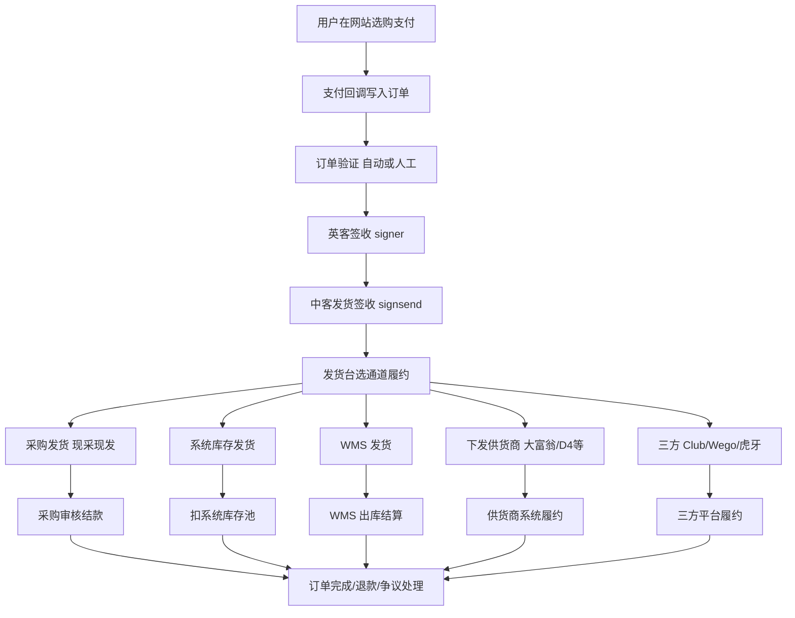
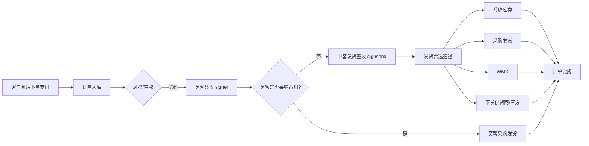

# Procurement and overseas orders
_Exported on 8/28/2026 at 16:47:42 GMT+8 from Cursor (3.17.8)_

---

**User**

阅读这项目 项目菜单有 一个采购收发管理 和一个 海外订单管理 顶级目录  目录里有很多菜单 这几个菜单 主要业务流程是什么 生成一个md 文档 我要了解这两个目录下的业务

---

**Cursor**

先梳理项目里这两个顶级菜单的路由与页面结构，再据此归纳业务流程并写成 MD 文档。


正在核对历史菜单数据与关键业务文件，确保文档准确。


正在生成完整的业务流程文档。


已根据项目源码梳理业务流程，并生成文档：

**`docs/采购收发与海外订单业务说明.md`**

---

## 核心结论

### 采购收发管理 — 「货从哪来、怎么存、怎么出」

主要覆盖 `/purchase/*` 和 `/site/stock.*` 模块：

1. **供应商体系**：供应商档案、采购价配置
2. **采购建单**：系统采购、库存采购、订单采购、英客采购等
3. **审核付款**：`stock.purchaseAudit` 统一审核（6 种采购类型）
4. **入库**：审核通过后增加库存（`surplus_num`）
5. **出货**：`purchase.shipment.list` 系统出货，或发货台「海外库存发货」扣减

### 海外订单管理 — 「客户买了什么、怎么履约、怎么售后」

主要覆盖 `/site/site.*` 和部分发货模块：

1. **接单**：`site.order` — 待验证、未发货、争议、问题单等
2. **签收**：客服认领订单（签收/释放）
3. **发货**：`stock.sendOrder` — 采购发货 / 海外库存发货 / 库存发货
4. **售后**：退款、争议、订单反馈、风控

### 主链路串联

```
海外客户下单 → site.order 签收 → stock.sendOrder 发货
    → 产生采购需求 → stock.purchaseAudit / purchase.purchase.list 采购入库
    → 扣减库存 → 发货完成 → 售后处理
```

---

**说明**：菜单名称存在数据库 `yf_system_menu` 中，源码里没有硬编码「采购收发管理」「海外订单管理」。历史 SQL 中曾用「库存发货」「网站管理」等名称，生产环境可能已重组。文档末尾附有 SQL，可在数据库中查询当前精确菜单树。

如需把生产库菜单查询结果贴给我，我可以把文档里的「推断菜单名」替换成你环境中的准确名称。

---

**User**

这个是网站下单 之后 在哪里生成订单以及整个流程

---

**Cursor**

我来顺着「网站下单」入口，查订单在后端是在哪里创建的，以及后续整条履约链路。

确认关键：网站下单写库不在本仓库，本系统从支付成功通知开始接手。接着把整条链路补全。

**结论先说：网站客户下单时，订单不是在本仓库（yfos 后台）生成的。**

本仓库是运营后台。网站前台/商城 API（独立项目）先写库，支付成功后再回调本系统继续处理。

---

## 订单在哪里生成？

| 阶段 | 在哪 | 做什么 |
|------|------|--------|
| 客户下单 | **网站前台 / 商城 API（不在本仓库）** | 写入 `yf_mall_order` + `yf_mall_order_goods`，通常 `pay_status=1` 未支付 |
| 支付成功 | **本仓库** `Api.php` | 改成已支付，跑自动处理 |
| 客服履约 | **本仓库后台菜单** | 签收 → 发货 → 采购 |

本仓库里唯一明确「新建订单写库」的是后台**补单**：`mall/BfOrder.php`（订单号前缀 `BF`），不是网站客户下单。

---

## 进入本系统后的整条流程

```
网站选品结算 → 写入订单表（未支付）→ 跳转支付
        ↓ 支付成功
Api::orderPayNotice / orderNotify
        ↓
pay_status = 2，写支付记录
        ↓
Api::orderNotice（核心）
  · 风控 / 库存占用
  · 符合规则则自动验证（order_status=2, send_status=1）
  · 大额等规则可分流中客
        ↓
后台「订单管理」site.order
  · 待验证 / 未发货 / 问题单…
  · 客服签收 / 释放 / 人工验证
        ↓
「海外订单发货」stock.sendOrder
  · 采购发货 / 海外库存发货 / 库存发货
        ↓
需要采购时 → 采购审核 / 系统出货
        ↓
发货完成 → 售后（退款/争议/反馈）
```

关键入口：

- `app/admin/controller/Api.php` → `orderPayNotice()` / `orderNotify()` / `orderNotice()`
- 后台看到单：`/site/site.order` → `/site/stock.sendOrder`

---

已写成文档：`docs/网站下单到履约全流程.md`

若要精确定位「网站哪段代码 INSERT 订单」，需要打开对应的商城前台/API 仓库（与本后台共用同一套订单表）。有那个仓库的话可以继续顺着查。

---

**User**

他发货 有几个方向 还是说只有采购发货

---

**Cursor**

我先核对发货台里实际有哪些发货入口，再直接回答是只有采购发货还是多条路径。

**不是只有采购发货，发货有多条路径。**

在「海外订单发货」台（`stock.sendOrder`）里，主路径大致是这几类：

| 方向 | 界面入口 | 后端接口 | 货从哪来 |
|------|----------|----------|----------|
| **采购发货** | 「采购单」 | `采购发货` | 当场找供应商买，生成订单采购单 |
| **系统库存发货**（海外库存） | 「库存发货」按钮打开的是「系统库存发货」 | `系统库存发货` | 扣「系统采购」池里已有库存 |
| **库存发货** | 详情页等入口 | `库存发货` / `D2库存发货` | 扣自产/传统库存 |
| **三方/专项发货** | 部分游戏专用 | `三方发货`、ARC、Heygames、虎牙、Club 等 | 走外部平台或游戏专项通道 |
| **配单供应商** | 派给供应商发 | 供货商发货单审核 | 供应商侧履约 |

日志里也能对上：

- `21 → 28` 采购发货 → 完成  
- `22 → 29` 库存发货 → 完成  
- `30 → 31` 海外库存发货 → 完成  

日常最常见的是前两条：**没现货就采购发货；有系统池库存就系统库存发货。** 采购发货只是其中一条主路，不是唯一方式。

---

**User**

这块判断是由后端判断的吗 还是前端在页面操作的
这是五个发货通道嘛

---

**Cursor**

我去看发货台里这些按钮是怎么显示、怎么提交的，确认是前端点选还是后端自动判定。

**不是后端自动选通道，主要是人在页面上点哪个按钮。**

---

## 1. 谁做判断？

| 层 | 做什么 |
|----|--------|
| **前端** | 决定显示哪些按钮；操作员点「采购单 / 库存发货 / WMS / 发给供货商…」 |
| **后端** | 只负责你点了之后：校验库存、写采购单、扣库存、改状态、记日志 |

前端里是按 `game_id`、是否已签收等做按钮显隐，例如：

- 签收后才出操作按钮（`signsend == adminID`）
- 大富翁 `357`、POE `105` 等会藏/换按钮
- 「库存发货」按钮打开的其实是「系统库存发货」弹窗

后端**不会**先算好「这单只能走采购发货」再返回一个通道枚举；选路在页面操作。

---

## 2. 是不是五个发货通道？

**不完全是「五条平级通道」。** 更准确是：

### 通用主路径（日常最常见，约 3 条）

1. **采购发货** — 点「采购单」→ 选供应商、填单价数量 → 后端 `采购发货`
2. **系统库存发货（海外库存）** — 点「库存发货」→ 弹窗标题是「系统库存发货」→ 后端 `系统库存发货`
3. **传统库存发货** — 部分详情/老入口仍有；列表上旧 `stockSendAjax` 已基本注释掉

### 派发类（不算「自己发货扣库存」）

4. **发给供货商** — 把单派给供应商侧履约（`sendSupplier`）

### 游戏/系统专项（按游戏出现，不是每单都有）

5. **WMS 发货**、大富翁下发、D4 下发、三方/ARC/Hey 等 — 特定 `game_id` 才显示

所以：

- **不是固定五选一的统一通道模型**
- **是：通用 2～3 种 + 派供货商 + 若干游戏专项**
- 操作员在页面选；后端做执行和校验

日常记：**多数单是人在发货台里选手动「采购」还是「扣系统库存」；后端不自动替你选。**

---

**User**

如果是采购发货 会生成采购单 采购单审核之后的流程是什么

---

**Cursor**

我顺着「采购发货 → 生成采购单 → 审核」这条链路，把审核后的后续步骤查清楚。

**关键点：采购发货时，客户侧发货已经做完了；后面的「采购单审核」主要是管供应商货款，不是再发一次货。**

---

## 采购发货当时发生了什么

操作员在发货台点「采购单」提交后，后端 `send_by_purchase` 会立刻：

1. 更新商品 `send_num`
2. 订单改为 **发货完成**（`send_status=3`）或 **部分发货**（`4`）
3. 写日志：`21 采购发货` / `28 采购发货完成`
4. **同时生成采购单** `MallOrderPurchase`：`audit=0`（未审核）

也就是说：**货已经按这单记成发出去了，采购单是事后要付钱的凭证。**

---

## 审核之后的流程（财务侧）

```
发货台「采购发货」
   ↓ 立刻
订单已发货 + 生成采购单(audit=0, status=0未支付)
   ↓
采购单审核页 stock.purchaseAudit
   ↓
审核通过 (audit=1)  或  审核不通过 (audit=-1，可改后再审)
   ↓（必须先审过才能付）
付款 / 结算
   · 直接「支付」→ status=1 已支付
   · 或财务「生成结算单」→ status=2，再批量结算支付 → status=1
```

| 字段 | 含义 |
|------|------|
| `audit=0/1/-1` | 未审 / 通过 / 不通过 |
| `status=0` | 未支付 |
| `status=1` | 已支付（付给供应商） |
| `status=2` | 已进结算单，等批量结算 |

相关页面/接口：

- 审核：`stock.purchaseAudit` → `Purchaseaudit::audit`
- 支付：同页 → `Purchaseaudit::pay`（未审核不能付）
- 结算：财务 `finance.Payment` → 生成结算单 / 批量结算

---

## 一句话

> **采购发货 = 先发客户货 + 挂一笔待审采购单；审核通过后是给供应商结款（直接付或进结算单），不会再走一遍发货。**

审核不通过一般是改供应商/金额后重审，**不会自动把客户订单发货状态撤掉**（撤单/作废是另一套操作）。

---

**User**

我看页面 很多已支付 已完成的订单并没有签收 
这里会自动签收码

---

**Cursor**

我查一下支付成功后有没有自动签收逻辑，以及「签收」字段具体指的是哪一个。

**会“自动验证”，一般不会“自动签收给人”。**  
你看到很多已支付、已完成但没有签收人，多数是正常的。

---

## 先分清两个「签收」

| 字段 | 页面 | 含义 |
|------|------|------|
| `signer` | 订单管理 `site.order` | 客服认领做验证/处理 |
| `signsend` | 发货台 `stock.sendOrder` | 中客认领做发货 |

页面上的「签收」按钮，都是**人点的**，把当前账号写进对应字段。

---

## 支付后真正自动做的是什么？

支付成功进 `orderNotice` → 调 `OrderService::SendSign`。

它做的是 **程序自动验证**，不是把单签到某个人名下：

- `order_status = 2`（验证通过）
- `send_status = 1`（待发货，若还没有）
- **`signer = ''`（清空签收人）**
- 日志：**「程序自动验证」**

代码注释里写得很直白：不满足条件就 `return 0; //不自动签收`。  
函数名叫 `SendSign`，实际是**自动过验证**，不是自动认领。

触发条件大致是：金额低于阈值、无历史问题、风控过关、支付方式/游戏在白名单等（不完全列出）。

---

## 为什么已完成却看不到签收？

常见几种：

1. **自动验证过的单**  
   不需要人工点「签收」就能进待发货，所以 `signer` 经常是空的。

2. **部分游戏自动发货**（如大富翁开了 `send_auto` 等）  
   验证通过后系统直接下发，可能**没人点过发货签收**，`signsend` 仍是 `0`，但订单已经完成。

3. **发给供货商 / 三方通道**  
   不一定走「我签收后再点采购发货」那条人工链路。

4. **发货签收本身是人工的**  
   `SendOrder::orderSign` 才会写 `signsend = 当前人`；没有人点，就一直是未签收。

所以：**已支付 + 已完成 ≠ 一定有人签收过。**

---

## 一句话

> **有自动验证，没有普遍的“自动签收到某个人”。**  
> 空签收的已完成单，多半是自动验证 / 自动发货 / 供应商通道走完的，属于预期现象，不是页面坏了。

若要确认某张单，打开订单日志看有没有「程序自动验证」「发货签收」即可。

---

**User**

什么情况会自动验证通过 系统下发是什么意思

---

**Cursor**

我把「自动验证」的判定条件和「系统下发」对应的代码入口对齐说明。

## 一、什么情况会自动验证通过？

支付成功后会跑自动验证（日志常见：**程序自动验证** / **系统自动验证**）。通过后大致是：

- `order_status = 2`（验证通过）
- `send_status = 1`（待发货）
- `signer` 清空

前提一般是：当前还是 **待验证**（`order_status = 1`）。

### 常见会过的情况

**1）支付方式白名单（较松）**  
如 ideal、giropay、blik、bancontact、paysafecard、infini、部分 Stripe 本地支付等 → 直接自动验证。

**2）金额 + 风控规则（主路径）**  
同时满足大致才过：

| 条件 | 说明 |
|------|------|
| 金额 | 默认 **&lt; $200**；动森/法环/大富翁/POE 等部分游戏阈值可到 **$10000** |
| 历史问题 | `hasProb` 无问题（争议/欺诈类历史） |
| 风控 | `orderFraud` 未命中 |
| 老客次数 | 不在“免计次”名单的游戏：同邮箱完成单 **&gt; 9** 才更容易过；新客更严 |
| 游戏黑名单 | Runescape、Dofus、Albion、FC25/26 等 **默认不自动审**（除非支付方式在白名单） |

**3）Api 里还有一套按游戏/支付方式的“系统自动验证”**  
部分游戏（动森、地平线、星空等）或上述支付方式，在 Stripe 等分支里也会直接改成验证通过。

**4）特例**  
- 法环：&lt; $100 且无争议问题 → 可自动过  
- 某些零小数位币种、积分支付 `score`、指定 game → 可能强制不走自动（当风控处理）

**不过的单**会停在「待验证」，要人在订单管理里人工验证。

---

## 二、「系统下发」是什么意思？

**下发 ≠ 客服自己点采购发货。**  
意思是：**系统（或人手）把履约任务推给供货商/专项通道去发**，日志里常见「自动下发」「下发供应商」「卡片下发」等。

| 类型 | 含义 | 例子 |
|------|------|------|
| **自动下发** | 验证通过后，配置开关打开时，程序自动推给供应商 | 大富翁 `send_auto` / `send_star_auto` 等 → `prod_send` |
| **手动下发** | 发货台上点「下发 / 卡片下发 / 星星下发…」 | 确认框就是「是否下发供货商发货」 |
| **供应商派单** | D4/POE 等审核通过后 `supplierSend` | 自动生成供货商发货单 |

大富翁自动下发时，系统会组好商品，指定供应商（如 id `68`），走类似采购发货的逻辑，备注常是 **「系统自动发货」**，人不用先签收再点采购单。

---

## 三、串起来看

```
支付成功
  → 自动验证通过？ 
       是 → 进入待发货
              → 部分游戏开了开关 → 系统自动下发供货商（可能直接完成）
              → 否则 → 人在发货台：采购发货 / 库存发货 / 手动点下发
       否 → 停在待验证，等人审
```

**一句话：**  
- **自动验证** = 系统把单从「待验证」改成「可以发」  
- **系统下发** = 系统（或按钮）把单丢给供货商去发，不是中客自己在游戏里点发货

---

**User**

那这里的系统下发 走的不是 系统库存 和采购 走的是什么？

---

**Cursor**

对，**系统下发既不是「系统库存发货」，也不是发货台上那种「采购发货」。**

它走的是第三条路：**供货商履约通道（把单推给外部供货商去发）**。

---

## 三条路对比

| 方式 | 货从哪来 | 谁操作 |
|------|----------|--------|
| 系统库存发货 | 扣自己的系统采购库存池 | 中客在发货台点 |
| 采购发货 | 当场建采购单，找供应商买完再发 | 中客在发货台点 |
| **系统下发** | **不扣自家库存；把任务推给供货商系统** | 程序自动，或页面点「下发」 |

---

## 系统下发实际在干什么

以大富翁自动下发 `prod_send` 为例：

1. 组好商品、客户游戏链接等信息  
2. **HTTP 调外部供货商接口**（推单）  
3. 本地记 `MonopolyLog` 等下发记录  
4. 订单改成 `send_status = 6`（待确认）  
5. 日志写：**自动下发** / **下发供应商**

成功只表示「已经交给供货商」，**不是**已经从系统库存扣完货。

页面上的「卡片下发 / 星星下发 / D4 下发」确认文案也是：**是否下发供货商发货** —— 同一类。

D4/POE 还有 `supplierSend`：验证通过后生成 **供货商发货单**（`SupplierSend`），同样是派给供应商侧，不是扣系统池。

---

## 一句话

> **系统下发 = 外包给供货商发货（API/供货商单），不是走系统库存，也不是中客自己点的采购发货。**  
> 自家库存不够或这类游戏本来就靠供应商履约时，用这条通道。

---

**User**

什么情况下会触发自动下发  需要人工点击下发嘛

---

**Cursor**

我把自动下发的触发条件和开关查清楚，再说明哪些仍要人工点。

**自动下发有条件；开关关了、失败了、或非这类游戏，就要人工点。**

---

## 什么时候会自动下发？

主路径（大富翁 **Monopoly Go / game_id=357**）：

```
支付成功 → 自动验证通过（isAuto=1）
        → 看系统配置开关是否打开
        → 该类型还没下发过
        → 自动调 prod_send / prod_sendstar …
```

人工在订单里把状态审成「验证通过」时，大富翁也会再走一遍同样的自动下发逻辑。

### 配置开关（后台大富翁配置）

| 开关 | 作用 |
|------|------|
| `send_auto` | 自动下发卡片（普通站） |
| `send_ezg_auto` | EZG 站（site_id=62）自动下发卡片 |
| `send_star_auto` | 自动下发星星 |
| `send_dice_auto` | 自动下发骰子 |
| `send_shut_auto` | 自动下发拆家 |
| `send_cod_auto` | COD 自动下发（game 520） |

**开关 = 1 才自动；= 0 就不自动。**

另外：车位、赛车在代码里验证通过后也会直接调（不严格看开关），但失败/漏发仍可在发货台手动补。

---

## 还要不要人工点「下发」？

| 情况 | 要不要点 |
|------|----------|
| 开关开着 + 自动验证过 + 接口成功 | **不用点**，系统已下发 |
| 开关关着 | **要人工点** |
| 自动下发失败（链接错、重复、供货商报错等） | **要人工再点或改问题单** |
| 没走到自动验证（还在待验证） | 先人工验证；验证通过后若开关开着会自动下，否则再点 |
| D4 等非大富翁「下发」按钮 | **基本都是人工点**（或走别的供应商自动派单，不是这套 Monopoly 开关） |
| COD（520） | 看 `send_cod_auto`；关了就人工点「下发」 |

发货台上的「卡片下发 / 星星下发 / D4 下发」就是**补发/手动触发**入口。

---

## 一句话

> **自动下发 ≈ 大富翁（及少数 COD）+ 验证已通过 + 对应开关打开。**  
> 满足就不用点；开关关、失败、或其他游戏，就要在发货台人工点「下发」。

---

**User**

能按照前端项目配合后端服务 把这个后台涉及到的整个流程 尤其针对订单这块详细的梳理出来 整个业务流程包括按钮控制 都详细的描述出来 生成一个md 文档 

---

**Cursor**

我会按「前端页面操作 ↔ 后端接口」把订单全链路（含按钮显隐与控制）系统梳理，并生成一份完整 MD。

已生成文档：

**`docs/后台订单全流程-前后端详解.md`**

文档按「前端页面操作 ↔ 后端接口」写清了订单整条链路，主要包括：

1. **系统边界**：网站建单 vs 本后台履约  
2. **状态机**：支付 / 订单 / 发货 / 采购单 / 日志 sub_type  
3. **总流程图**  
4. **支付回调与自动处理**（`Api::orderNotice`）  
5. **订单管理（英客）**：Tab、签收/释放、审核、问题单等按钮条件与接口  
6. **发货台（中客）**：发货签收前提、采购/系统库存/下发/WMS/派单按钮矩阵  
7. **采购审核与财务结算**（发货后结款）  
8. **系统采购池**  
9. **三条履约通道对比** + **自动验证/自动下发条件**  
10. **前后端文件索引**与四条最短操作路径  

核心结论也写在文档里：**通道由人在页面点选；后端做校验落库；自动验证≠自动签收；采购审核在发货之后管货款。**

---

**User**

这个发给三方 是什么意思 club 配置 wego 配置和虎牙配置这块是干嘛用的

---

**Cursor**

我查一下「发给三方」以及 Club / Wego / 虎牙 配置各自对应的业务用途。

**「发给三方」= 把履约推给外部充值/分销平台，不是扣自家系统库存，也不是发货台那种「采购发货」。**

页面上的 **Club / Wego / 虎牙**，就是三家不同的第三方通道；配置用来把「咱们站的商品」对上「他们平台的商品」，下发时才能调他们的 API。

---

## 1. 「发给三方 / 三方询价」是什么？

发货详情里有 **「三方询价」**，弹窗里三行：

| 名称 | 按钮 | 实际对接 |
|------|------|----------|
| 虎牙 | 下发虎牙 | 虎牙充值 API |
| Wego | 下发Wego | **Heygames**（`heygames.io`，界面叫 Wego） |
| Club | 下发Club | TopupClub（`topupclub.com`） |

流程大致是：

```
看三家报价 → 人选一家点「下发」
  → 按绑定关系调三方下单 API
  → 三方给客户游戏账号充值/发货
  → 回调成功后，本后台记「Club/Hey/虎牙采购发货(完成)」
```

适用常见是 **手游直充类**（如 MLBB、原神、绝区零、鸣潮等），详情里还有「club查服」一类按钮。

> 注意：后端还有个注解叫「三方发货」的 `prod_send`，那是 **大富翁推供货商**，和 Club/Wego/虎牙不是同一套。你问的配置菜单，对应的是询价弹窗这三家。

---

## 2. 这三块配置是干嘛的？

本质都是 **映射表 + 商品同步**，不是发货按钮本身。

| 配置 | 对接谁 | 配置里做什么 | 发货时干什么 |
|------|--------|--------------|--------------|
| **Club 配置** | TopupClub 分销 | 同步三方游戏/商品；把本站 `goods_no` 绑到 Club 的 `deno_id` + 数量倍率 | `下发Club` → `ClubService` 调 `api.topupclub.com` |
| **Wego 配置**（代码里 heygames） | Heygames | 同步游戏/面额；绑定本站商品 ↔ Heygames 商品 | `下发Wego` → `HeygamesService` 调 `heygames.io` |
| **虎牙配置** | 虎牙 | 同步虎牙 SKU；绑定本站商品 ↔ 虎牙商品（含区服等） | `下发虎牙` → `HuyaService` 下单 |

没配绑定就下发，会找不到三方 SKU，下发失败。

配置菜单典型结构：

- 游戏列表 / 游戏绑定  
- 商品列表（从三方拉）  
- 商品绑定（本站商品 ↔ 三方商品）  
- 三方订单列表（查他们单号、状态）

---

## 3. 和采购发货、系统库存的区别

| 方式 | 谁发货 |
|------|--------|
| 采购发货 | 你们找供应商，中客记采购单 |
| 系统库存 | 扣自家池子 |
| **Club / Wego / 虎牙** | **第三方充值平台 API 直充** |

日志里会看到类似：**Club采购发货**、**Hey采购发货**、**虎牙采购发货完成**（走的是三方采购语义，不是 `stock.purchaseAudit` 那套中客采购单主流程）。

---

## 一句话

> **发给三方 = 用 Club / Wego(Heygames) / 虎牙 替你给客户游戏账号充值发货。**  
> 三块配置 = 维护「咱们卖什么 ↔ 他们卖什么」的绑定，保证下发时能正确调 API、对上价格和面额。

---

**User**

club 配置里有游戏列表 主要是本站的游戏和三方游戏绑定上 然后获取商品 能获取到商品然后再绑定到本站？

---

**Cursor**

我按 Club 配置页和绑定接口，核对「游戏绑定 → 拉商品 → 再绑本站商品」这条流程是否如此。

**对，你的理解基本正确。** Club 配置就是按这个顺序用的：

---

## Club 配置实际步骤

```
① 游戏列表：本站游戏(+服务器) ↔ Club 的 product_id（三方游戏）
        ↓
②（可选）绑定模版：把本站模板挂到这条游戏绑定上
        ↓
③ 点「获取商品」：按 product_id 调 Club API，把三方面额拉进本地 Club 商品表
        ↓
④ 商品绑定：本站商品 goods_no ↔ Club 的 deno_id（+ 数量倍率 qty）
        ↓
⑤ 发货时「下发 Club」才能根据绑定找到三方 SKU 去下单
```

---

## 各页对应关系

| 步骤 | 页面操作 | 存什么 |
|------|----------|--------|
| 1 | 游戏列表点「绑定」 | 本站 `game_sku`/`server_id` ↔ Club `product_id`（及三方服务器） |
| 2 | 「绑定模版」 | 本站模板关联到这条游戏绑定 |
| 3 | 「获取商品」 | 调 Club `/goods`，写入本地 Club 商品（`deno_id`、价格等） |
| 4 | 商品绑定页 | 本站 `goods_no` ↔ `deno_id` + `qty` |

商品列表页主要是看已拉下来的三方商品；**真正能下发，靠的是第 4 步绑定**。

---

## 注意点

1. **必须先做游戏绑定**，否则商品列表会提示「请先绑定游戏」。  
2. **获取商品**是同步三方目录，不是自动绑到本站 SKU。  
3. **qty**：本站卖 1 件可能对应 Club 多件面额（倍率）。  
4. 没绑商品就点「下发 Club」会失败（找不到 `deno_id`）。

**一句话：游戏先绑 → 拉三方商品 → 再绑到本站商品；之后发货才能走 Club。**

---

**User**

什么情况下走三方 是人工手动的吗

---

**Cursor**

**对，Club / Wego / 虎牙 这条「三方」目前是人工手动走的，支付成功后不会像大富翁那样自动下发。**

---

## 什么时候会走三方？

没有后端「自动分流到 Club」的开关。实际是：

1. **订单适合直充**（常见手游：MLBB、原神、绝区零等），且  
2. **Club/Wego/虎牙里已做好游戏+商品绑定**，且  
3. **中客在发货台已签收**（`signsend == 本人`），且  
4. **人打开详情 → 点「三方询价」→ 看三家价 → 点「下发虎牙 / 下发Wego / 下发Club」**

只有第 4 步点了，才会调三方 API。

定时任务（09:08、19:38）只是 **同步三方价格**，不是自动发货。

---

## 和自动下发的区别

| | 大富翁自动下发 | Club/Wego/虎牙 |
|--|----------------|----------------|
| 触发 | 验证通过 + 配置开关 | **人工点按钮** |
| 是否自动 | 可以自动 | **不会自动** |
| 入口 | 系统 / 发货台「下发」 | 详情「三方询价」 |

---

## 操作路径（简）

```
发货签收
  → 打开订单详情
  →「三方询价」（看虎牙 / Wego / Club 报价）
  → 人选一家点「下发xxx」
  → 三方充值 → 回调更新本站发货状态
```

没绑商品、没签收，按钮即使点了也会拆分/下发失败。

**一句话：走不走三方由人在发货详情里决定；系统不会自动替你选 Club/Wego/虎牙。**

---

**User**

再帮我分析wms 干嘛用的 什么情况下会用到 整个wms 业务流程

---

**Cursor**

我梳理 WMS 模块的用途、触发场景和整条业务流程。

WMS 是**独立仓库管理系统**（默认 `wms.gamebee.com`），和本站「系统采购池 / 采购发货」不是同一套库存。完整说明已写在 `docs/WMS用途与业务流程.md`。

### 干什么用
管有仓/区/库位结构的实物库存：建仓、物品 SKU、采购入库、调拨换货、盘点报损、销售出库、应付结算。yfos 只做菜单壳 + Token，真实业务走 `/service/*`。

### 什么时候用
1. **日常仓管**：进货、查库存、调拨、退料、结供应商款 → 用 `views/wms` 各菜单。  
2. **订单履约**：发货台对特定游戏手动点「WMS发货」——主要是 `game_id == 105`（POE 等）和 `game_id == 3`，且已发货签收。**支付/自动验证不会自动进 WMS。**

### 订单侧最短流程
```
点「WMS发货」→ sale_create 在 WMS 建销售单
  → 弹窗选仓内库存 → deliver_create 扣库存发货
  → 本站更新 send_num / 发货状态（日志：WMS库存发货）
```

### 和其它通道怎么选
| 通道 | 适用 |
|------|------|
| 采购发货 | 没现货、现采 |
| 系统库存 | yfos 采购池有数 |
| Club/Wego/虎牙 | 手游直充询价 |
| **WMS** | **仓里已有货，要扣仓发（如 POE）** |

一句话：**WMS 管仓库进销存；订单只有仓有现货的游戏才人工走「WMS发货」。**

---

**User**

wms 中的产品规则和前缀主要有什么作用 应付单和结算单

---

**Cursor**

我先看 WMS 里产品规则、前缀，以及应付单、结算单的页面与接口字段。

### 产品规则 & 产品前缀

两者都是在给仓内物品编 **SKU/SPU 编码体系**，不是发货业务本身。

**产品规则（skuRule）**  
定义「编码怎么拼」的树形字典：

```
游戏 → 平台/设备 → 服务器 → 物品类型 → 分类 → 站点
示例：100000-10-000010-01-000000-00
含义：游戏-平台-服务器-物品类型-分类-站点
```

- 平台如：通用 `10`、PC `20`、PS `30`、Steam `50` 等  
- 类型：单品 `01` / 组合 `02`（页面写物品类型常固定 `01`）  
- 分类：3 位大类 + 3 位小类  
- 可开关、加下级；点「生成 hash」→ 按规则生成前缀记录  

**产品前缀（skuHash）**  
规则「落地」后的 **SPU 清单**（名称 + `spu` 码）。  
后续物品、库存、采购、出入库、发货明细都按这个 `spu` 认货。

关系一句话：

> **规则 = 编码规范；前缀 = 按规范生成出来的具体 SPU。**  
> 先配规则 → 生成 hash → 再维护物品 / 采购入库。

---

### 应付单 & 结算单

这是 **WMS 采购货款** 的两步结账，和中客「采购单审核」平行，只结仓采。

**应付单（payable）**  
采购入库审核后产生的「欠供应商多少钱」。列表里看供应商、仓/区/位、金额、支付类型、是否 `unpaid`。

支付类型常见：
- `wait` 财务待付  
- `prepay` 自我垫付（可再选垫付类型）  
- `deductions` 账号扣款  

未付时可「生成结算单」或批量勾选生成。

**结算单（settlement）**  
把多笔应付 **打包成一张付款单**（标题、总笔数、总金额）。  
未结算时可改明细（移除某笔应付）、上传付款截图/备注、「设为已结算」、批量结算、导出。

流程：

```
采购入库审核 → 产生应付单(unpaid)
  → 勾选生成结算单
  → 财务付款并标记已结算(paid)
```

一句话：

> **应付单 = 单笔采购欠款；结算单 = 多笔应付合并后真正去付/记账。**

---

**User**

如果走wms 发货 他是先看有库存嘛 如果没有库存会怎么样 这个wms 商品从哪里来的

---

**Cursor**

我顺着发货台「WMS发货」和库存选择逻辑，确认有没有库存校验、无库存时怎么处理，以及商品从哪入库。

是的，**发货前会先查 WMS 库存**；没货就发不出去（或只能发有货的那部分）。商品不是商城下单时自动进仓的，要先在 WMS 建物品再采购入库。

### 发货时怎么看库存

点「WMS发货」实际两步：

1. **`sale_create`**：先在 WMS 建销售单（这一步主要同步订单，不直接扣库存）
2. 打开弹窗 → 调 **`/service/stock/buyUser`**（`getStockUserByOrder`）  
   按订单/游戏查「哪些库存账号（库位）有货」

前端会：
- 有返回账号才显示「选择账号」
- 用订单商品 `order_goods_id` 去对仓内库存 `itemNo`
- 发货数量 `p_num` 自动取：`min(仓内数量, 订单待发数量)`

提交时走 **`deliver_create`**，WMS 真正扣库存；成功才回写本站 `send_num` / 发货状态。

### 没有库存会怎样

| 情况 | 表现 |
|------|------|
| 一个可用账号/库位都没有 | 选账号下拉不出现（`wmsStockUser` 为空），没法正常选库发货 |
| 有账号但对应商品数量为 0 | 该行 `p_num=0`；后端 `num<=0` 会丢掉该行 |
| 库存不够全发 | 只能按现有数量发 → 本站变**部分发货**；够发完 → **发货完成** |
| WMS 扣库失败 | 接口报错（`WMS接口返回失败` / 具体 error），本站订单不改 |

不会自动去采购补货，也不会自动切采购发货；人要另走采购入库或换别的发货通道。

### WMS 商品从哪来

分两层：

**1. 物品主数据（能认货）**  
```
产品规则 → 生成前缀(SPU)
  → 物品管理「上传物品」建/改物品
  →「绑定销售商品」和商城商品对上
```
没有物品 + 没绑销售商品，订单行就对不上仓内库存。

**2. 库存数量（能发出去）**  
主要靠 **采购管理 → 采购入库 → 审核**：  
选供应商 + 仓库/区域/位置 + 物品数量 → 入库加库存。

之后也可调拨、换货、盘点调整；**客户下单本身不会往 WMS 加货**。

### 一句话

> **WMS 发货 = 先建销售单，再按库位查现货，有多少发多少；没货就发不了。**  
> **货来自：先维护物品(SPU)，再采购入库进仓；不是网站订单自动生成的。**

---

**User**

wms 是怎么入库的 和出库的

---

**Cursor**

我对照采购入库、发货出库以及出入库相关页面，把 WMS 的入库/出库路径说清楚。

WMS 的出入库都落在 **仓库 → 区域 → 位置**，不是商城订单自动进仓。核心如下。

### 入库（库存变多）

**主路径：采购入库**

```
采购管理 →「采购入库」
  → 选供应商、仓库/区域/位置、物品、数量、单价、付款类型
  → 提交（status = pending）
  → 点「审核」通过
  → 对应库位库存 +N
  → 同时产生应付单（后面可生成结算单付款）
```

前提：物品主数据已存在（规则/前缀 → 物品管理上传），采购时才能选到。

**其它也会入库**

| 场景 | 说明 |
|------|------|
| 转货（调入方） | A 仓出、B 仓入，审核后目标库位加库存 |
| 换货（目标物） | 消耗 A 物品，生成 B 物品库存 |
| 盘点/其它调整 | 视盘点结果，也可能补录入库流水 |

**出入库管理**里 `direction = in` 就是这些入库流水（查账用，一般不在这里手动作入库）。

---

### 出库（库存变少）

**主路径①：销售发货（客户订单）**

```
发货台「WMS发货」
  → 建 WMS 销售单
  → 选有货的库存账号/库位，填发货数量
  → deliver 扣库存
  → 发货管理可查记录
```

**主路径②：退料出库（退供应商）**

```
退料管理 →「退料」
  → 关联采购/选仓位物品数量
  → pending → 审核
  → 库存 -N
```

**其它也会出库**

| 场景 | 说明 |
|------|------|
| 转货（调出方） | 源库位减库存 |
| 换货（来源物） | 源物品减库存 |
| 盘点报损 | 审核后减库存 |

出入库管理里 `direction = out` 对应这些出库流水。

---

### 一张图串起来

```
供应商 ──采购入库审核──► 仓/区/位库存
                              │
              ┌───────────────┼───────────────┐
              ▼               ▼               ▼
         WMS发货扣库      退料/报损出库     转货/换货
              │               │
              ▼               ▼
           客户订单        供应商退回/损耗
```

### 要点

1. **入库靠采购审核**，不是网站下单。  
2. **对客户出库靠发货台 WMS 发货**；退供应商靠退料。  
3. 单据多是 **创建 → pending → 审核** 才真正改库存。  
4. **出入库管理 / 库存流水** 是结果台账，用来核对 `in` / `out`。

---

**User**

这个项目 在网站上从能看到导航到上架商品整个流程 详细描述一下生成md 文档

---

**Cursor**

我先在代码里梳理网站导航、商品与上架相关模块，再整理成 MD 文档。


接着核对关键页面与接口，确保文档里的步骤和按钮准确。


正在生成完整 MD 文档。


已生成文档：`docs/网站导航到上架商品全流程.md`

### 文档结构概览

1. **总体说明** — yfos 是运营后台，消费者网站独立读库  
2. **核心数据模型** — 站点 → 导航 → 游戏 → 模板 → 服务器 → 分类 → 商品  
3. **完整业务流程（4 个阶段）**
   - **阶段 0**：站点注册（`yf_system_site`）
   - **阶段 1**：游戏 / 模板 / 服务器 / 分类
   - **阶段 2**：网站导航（`site.nav` → `yf_mall_game_site`，新增后 `NavGoods` 自动复制商品）
   - **阶段 3**：商品上架（物品 Excel 上传、金币手动/批量、隐藏/恢复）
   - **阶段 4**：公开站展示 + **手动 `clearsitecache` 刷缓存**
4. **端到端流程图**（Mermaid）
5. **用户在网站上的浏览路径**
6. **页面 / API / 数据表索引**
7. **常见场景速查**（新游戏上线、新站点、下架、补货、导航不显示排查）

### 核心结论

| 环节 | 关键动作 |
|------|----------|
| 能看到导航 | `site.nav` 添加，`is_index=1` |
| 能买到商品 | `status=1` + `stock>0`，主要靠 **Excel 上传** |
| 网站生效 | 改完后调 **`clearsitecache`**，不是「一键更新导航栏」 |

如需把某一段（比如 Excel 列说明、或某个具体站点 iggm/poe）再展开成操作手册，可以说一下我补一节。

---

**User**

系统采购从哪里发起的

---

**Cursor**

我先在发货台和采购相关代码里定位「系统采购」是从哪里发起的。

**系统采购是从「采购收发管理 → 系统采购列表」人工发起的**，不是客户下单自动产生。

### 主入口

| 项目 | 说明 |
|------|------|
| 页面 | `views/src/views/purchase/purchase.list/index.vue` |
| 按钮 | **采购导入** |
| API | `POST /admin/stock.system_purchase/add` |
| 后端 | `app/admin/controller/stock/SystemPurchase.php::add()` |
| 写入 | `yf_mall_system_purchase` |

操作员填游戏/模板/设备/服务器、采购类型（国内/海外）、数量单价、供应商等 → 提交入库。

### 发起后发生什么

```
采购导入
  → 写入 yf_mall_system_purchase（库存量 = 采购数 - 手续费）
  → 同步生成一笔采购审核单（结款用，mode=5 国内 / mode=6 海外）
  → 国内：audit=0，等审核；海外：一般自动 audit=1
  → 审核通过后进「系统库存池」
  → 发货台「库存发货 / 系统库存发货」再扣这批库存
```

### 其它会「产生」系统采购单的路径（不是主发起）

| 路径 | 说明 |
|------|------|
| **转货**（同页「转货」） | 从已有采购单挪库存到新区服，会再插一条新采购单 |
| **库存校正/补货类** | `SystemRepertory` 等调整库存时可能再写记录 |

这些都是在已有池子上调整，**不是从零采购**。

### 容易混淆的

| 名称 | 是不是系统采购 |
|------|----------------|
| 发货台「采购发货」 | 否，现采现发，走 `MallOrderPurchase` |
| `stock.stockPurchase`「添加采购单」 | 否，账号库存采购（另一套） |
| `service.list` 英客采购 | 否，英客侧采购 |
| WMS 采购入库 | 否，WMS 仓采 |

**一句话：系统采购从 `purchase.list` 的「采购导入」发起，人工备货进系统库存池；订单侧只是后来去扣这批库存发货。**

---

**User**

所以这个项目 采购有几个入口 分 一个使用户下单 一个是系统采购嘛

---

**Cursor**

不完全是「两个」。和「采购」相关的入口至少有这几类：

### 1. 系统采购（备货进池）
- **入口**：`purchase.list` → **采购导入**
- **目的**：人主动采货，进 **系统库存池**（`yf_mall_system_purchase`）
- **和用户订单**：无直接关系；订单之后用「库存发货」来扣

### 2. 订单采购发货（用户下单后现采）
- **入口**：发货台 `stock.sendOrder` → **采购发货**
- **目的**：客户订单没现货时，找供应商现采现发
- **写入**：`yf_mall_order_purchase`（结款走采购审核）
- **和用户订单**：强绑定某一笔商城订单

### 3. WMS 采购入库（仓采）
- **入口**：WMS → **采购入库**
- **目的**：进 WMS 仓/区/位库存，供「WMS发货」扣库
- **和用户订单**：不直接挂钩；发货时再对上订单

### 4. 英客采购（另一套）
- **入口**：`service.list`（英客采购）
- **目的**：英客侧采购录入/审核/支付，不是系统库存池那条主链路

### 5. 账号库存采购（较老/旁路）
- **入口**：`stock.stockPurchase`「添加采购单」
- **目的**：账号库存那套，和「系统采购」不是同一表

---

### 怎么记

| 类型 | 谁发起 | 为谁服务 |
|------|--------|----------|
| **系统采购** | 运营主动备货 | 系统库存池 → 以后订单扣库 |
| **订单采购发货** | 中客对**已下单**订单现采 | 当笔客户订单 |
| **WMS 采购** | 仓管备货 | WMS 仓 → WMS发货 |
| 英客/账号采购 | 各自业务 | 旁路 |

所以更准确说：

> **和用户下单强相关的采购 = 发货台「采购发货」**  
> **和用户下单无关、先备货的 = 系统采购（以及 WMS 仓采）**  

不是只有这两个入口，但日常最常对比的就是你说的这两条：**订单现采** vs **系统采购备货**。

---

**User**

英客采购 干嘛用的
第一个是系统 第二个是 用户下单 wms 应该也是用户下单选择wms 发货的把

---

**Cursor**

先核对英客采购的用途，再确认你对三条链路的理解。

你的理解大体对，补两点细节就齐了。

### 先对齐三条「货从哪来」

| # | 链路 | 是不是用户下单触发 | 干嘛 |
|---|------|--------------------|------|
| 1 | **系统采购** | 否，运营先备货 | 进系统库存池 → 之后订单点「库存发货」扣 |
| 2 | **采购发货** | 是，发货台对**已下单**订单现采 | 现找供应商采了就发，绑当笔订单 |
| 3 | **WMS** | **发货环节是**，**采购入库不是** | 见下 |

### WMS：分两层，别混成「用户选了 WMS」

- **WMS 采购入库**：像系统采购，仓管主动进货，**不是用户下单选的**。
- **WMS 发货**：用户已下单后，中客在发货台点「WMS发货」，从仓里扣现货发出。

所以：**订单履约时选 WMS 发货 = 对**；  
**WMS 整条链路都是用户下单选出来的 = 不对**（货要先采进仓）。

---

### 英客采购干嘛用的？

**英客（英文客服）侧的采购成本台账**，不是发货通道，也不是系统库存池。

- 入口：`purchase/service.list`
- 必填：**订单号** + 站点 + 游戏 + 班次 + 单价数量 + 商品类型（金币/物品/账号/代练）
- 流程：录入 → 审核 → 支付/驳回
- 作用：把英客为某笔订单花掉的采购成本记下来结账；可和订单「占用」挂钩

**不会**像「采购发货」那样直接改订单发货状态，也**不会**往系统库存/WMS 加货。

---

### 一句话对照

```
系统采购     = 先备货进「系统池」
采购发货     = 用户单现采现发
WMS采购+发货 = 先备货进「WMS仓」→ 用户单再选 WMS 发货扣仓
英客采购     = 英客给订单记一笔采购花费（财务台账）
```

你说的「第一个系统、第二个用户下单」对；WMS 发货也是用户单履约通道，但前面还有独立的仓采备货。

---

**User**

从用户下单到 采购发货 还有自动下发 以及三方发货 这些内容总结一下

---

**Cursor**

结合已有流程文档和代码，整理从下单到各发货通道的总结。

完整总结已写入 `docs/用户下单到发货通道总结.md`。核心如下：

### 公共前置
网站下单支付 → 回调进本仓 → 验证/签收 → 发货台履约。  
支付后**不会**自动采购发货或走三方；只有部分游戏会自动下发供货商。

### 三条重点通道

| 通道 | 谁触发 | 干什么 |
|------|--------|--------|
| **采购发货** | 中客人工 | 现找供应商采了就发，绑当笔订单；同时生成采购审核单结款 |
| **自动下发** | 支付回调（开关开）或人工点下发 | 推**供货商**（大富翁卡片/星星等），不是进系统库存池 |
| **三方发货** | 人工「三方询价」再下发 | Club / Wego(Heygames) / 虎牙 直充，**不自动** |

### 串起来
```
用户下单支付
  ├─（大富翁等 + send_auto）→ 可能已自动下发供货商
  └─ 发货台签收后人工选：
        ├─ 采购发货（没现货就现采）
        ├─ 库存/WMS（池或仓有货）
        └─ 三方询价 → Club/Wego/虎牙
```

一句话：**采购发货 = 订单现采；自动下发 = 推供货商；三方 = 人工询价走直充平台。**

---

**User**

我如何下载我们今天的对话

---

**Cursor**

今天这轮对话可以这样保存：

### 方法 1：Cursor 里导出（优先试）
1. 打开当前聊天面板  
2. 点右上角 **`...`（更多）**  
3. 看有没有 **Export / 导出 / Copy transcript** 之类选项  
不同版本文案可能略有差别。

### 方法 2：直接拷本地 transcript 文件
本机已有完整记录（JSONL）：

`C:\Users\Admin\.cursor\projects\d-work-yfos\agent-transcripts\f29fd6ec-c2a5-4941-9545-b48f8be6404f\f29fd6ec-c2a5-4941-9545-b48f8be6404f.jsonl`

在资源管理器打开该文件夹，复制 `.jsonl` 即可。  
这是原始对话日志，不是排版好的 Word。

### 方法 3：今天已整理的业务文档
对话里沉淀的结论多在仓库 `docs/`：

- `docs/WMS用途与业务流程.md`
- `docs/网站导航到上架商品全流程.md`
- `docs/用户下单到发货通道总结.md`

这些比原始聊天更适合留档。

---

需要的话我可以把今天对话整理成一份可读的 `docs/今日对话纪要.md`（问答摘要版），你直接下载/提交仓库即可。

---

**User**

我看采购收发管理中客里面有采购单审核 和采购站审核 这两个区别和作用

---

**Cursor**

我先在中客采购收发相关页面里核对「采购单审核」和「采购站审核」的入口与逻辑。

这两个名字很像，但管的是**两套完全不同的事**：

### 对比一览

| | **采购单审核** | **采购站审核** |
|--|----------------|----------------|
| 页面 | `stock.purchaseAudit` | 采购站相关（`site.sellSendOrder` / `SupplierSendOrder`） |
| 审什么 | 中客采货后的**结款单** | 采购站侧**卖家/供货商提交的货** |
| 核心表 | `yf_mall_order_purchase` | `SellOrder` / `SupplierSend` / D4 寄售单等 |
| 主要动作 | 审核通过/不通过 → **支付供应商** | 审核通过/不通过 → **上架或确认发货** |
| 和用户订单 | 多是订单采完后的**成本结算** | 玩家/供应商在「采购站」卖货或接单发货 |

---

### 1. 采购单审核 —— 结供应商的钱

发货台「采购发货」、系统采购导入等，都会生成采购单。  
这里审的是：**这单采得对不对、价量对不对，过了才能付款**。

常见类型（`mode`）：
- 1 订单采购  
- 2 库存采购  
- 5/6 系统采购国内/海外  

流程：
```
采完货生成采购单 → 采购单审核（通过/驳回）→ 支付 → 供应商结款完成
```

注意：客户侧发货往往在「采购发货」提交时已完成；这里主要管**钱**，不是再发一次货。

---

### 2. 采购站审核 —— 审采购站来的货/发货

「采购站」是另一条业务：玩家/供应商在采购站寄售、供货。  
中客在这里审的是：**对方交上来的物品能不能过、能不能算发货完成**。

典型动作：
- 审 D4 等寄售物：通过后绑定 `goods_no`，状态变「已上架」一类  
- 审采购站供货商发货凭证：通过后会走类似采购发货的回写，更新订单发货  

流程：
```
采购站用户上架/接单发货 → 中客采购站审核
  → 通过：上架到商城 或 确认订单发货
  → 不通过：退回/驳回
```

---

### 怎么记

```
采购单审核 = 我们向外采购后，审「该不该给供应商付钱」
采购站审核 = 采购站那边交来的货，审「能不能收/能不能上架/算不算发完」
```

一句话：  
**采购单审核管结算（钱）；采购站审核管采购站业务（货与发货确认）。**

---

**User**

也就是说不管是 用户下单选择了 采购发货 还是 系统采购 或者wms 采购 都会生成采购单到这里面？

---

**Cursor**

不完全是。我快速核对三种采购是否都会进「采购单审核」。

**不完全是。** 进「采购单审核」的只有本站这套 `MallOrderPurchase`，WMS 不进这里。

| 来源 | 会进「采购单审核」吗？ | 说明 |
|------|------------------------|------|
| **采购发货**（用户订单现采） | ✅ 会 | `mode=1` 订单采购 |
| **系统采购**（采购导入） | ✅ 会 | 同时写系统采购表 + 审核表；`mode=5` 国内 / `mode=6` 海外 |
| **WMS 采购入库** | ❌ 不会 | 走 WMS 自己的**应付单 / 结算单**，和本站采购单审核无关 |

### 怎么理解

```
采购发货 ──┐
系统采购 ──┼──► 采购单审核（结供应商钱）
           │
WMS 采购 ──┴──► WMS 应付/结算（另一套财务）
```

补充：
- **系统库存发货 / WMS 发货**：扣的是已备好的库存，**一般不会再新建**采购单；钱在当初入库/导入时已经（或正准备）走对应审核。
- 「采购单审核」里还能筛到库存采购、二手、海外等其它 `mode`，不只这两种。

一句话：**采购发货 + 系统采购 → 会进采购单审核；WMS 采购 → 不进，去 WMS 财务结。**

---

**User**

那么我怎么区分用户下的订单 是来自于哪个渠道 在哪里可以看到 渠道有哪些 系统采购 采购发货 wms 和自动下发 以及三方？

---

**Cursor**

我查订单日志、发货状态和发货台里如何标记各履约通道。

先澄清一点：**用户下单时不会选「采购发货 / 系统采购 / WMS」**。网站只下单付款；**履约通道是中客（或系统自动）在发货台事后选的**。所以订单上也没有一个「渠道」下拉字段，要靠**订单日志 + 关联单据**反查。

### 在哪里看

| 地方 | 看什么 |
|------|--------|
| **订单管理** `site.order` | 悬停/点开订单号 → **订单日志**（最主要） |
| **发货台** `stock.sendOrder` → 订单详情 | 同样有操作/发货记录 |
| 各业务菜单 | 旁证（采购单、WMS 销售单、三方单等） |

日志一般在 `yf_mall_order_log`，看 **备注文案** 和 **`sub_type`**。

---

### 各通道怎么区分

| 你说的概念 | 实际履约名 | 日志里常见字样 | sub_type（参考） | 旁证去哪看 |
|------------|------------|----------------|------------------|------------|
| 采购发货 | 采购发货 | `采购发货` / `采购发货完成` | 21 / 28 | **采购单审核**，`mode=1`，订单号对得上 |
| 系统采购 | ❌ 不是发货通道 | — | — | 只是备货；用户单对应的是下面「库存发货」 |
| （系统池发货） | **系统库存发货** / 海外库存发货 | `库存发货`、`海外库存发货` | 22/29、30/31 | 系统库存/出货相关；扣的是系统采购池 |
| WMS | WMS发货 | `WMS库存发货` | 常用 28 | **WMS → 订单管理 / 发货管理**，`biz_no`=订单号 |
| 自动下发 | 下发供货商 | `自动下发`、`自动下发供货商`、骰子/星星自动下发 | 视具体接口 | 大富翁相关表（卡片/星星等） |
| 三方 | Club / Wego / 虎牙 | `Club采购发货`、`Hey采购发货`、虎牙相关 | 常复用 21/28 | Club/Heygames/虎牙订单与配置页 |

---

### 和你列的 5 项怎么对齐

```
用户下单支付
    ↓
中客在发货台选通道（或系统自动下发）
    ├─ 采购发货      → 日志「采购发货」+ 采购单审核 mode=1
    ├─ 系统库存发货  → 日志「库存发货」(货来自之前的系统采购)
    ├─ WMS发货       → 日志「WMS库存发货」+ WMS 销售/发货单
    ├─ 自动/手动下发 → 日志「自动下发…」+ 供货商侧记录
    └─ 三方发货      → 日志 Club/Hey/虎牙 + 三方单号
```

**系统采购本身不会写在用户订单的「发货渠道」上**——它是先备货；订单侧显示成「库存发货」。

---

### 实用查法（一单怎么认）

1. 打开该订单日志，搜关键字：`采购发货` / `库存发货` / `WMS` / `自动下发` / `Club` / `Hey` / `虎牙`  
2. 一单可能**拆开多通道、部分发货**（例如一部分库存、一部分采购）  
3. 仅看 `send_status`（待发/部分发/发完）**分不出通道**，必须看日志或关联单  

一句话：**没有「下单选渠道」；在订单日志里看发货备注区分通道；系统采购只备货，用户单对应的是「库存发货」。**

---

**User**

前端在哪里可以看到

---

**Cursor**

前端主要在这两个地方看，**看订单详情里的「发货日志」文案**：

### 1. 订单管理（最常用）
路径大致：**网站管理 / 订单相关 → 订单列表**（页面 `site.order`）

1. 点开某笔 **订单号**（打开详情弹窗）  
2. 右侧时间线区域  
3. 切到 **「发货日志」**  
4. 看每条备注，例如：
   - `采购发货` / `采购发货完成`
   - `库存发货` / `海外库存发货`
   - `WMS库存发货`
   - `自动下发…`
   - `Club采购发货` / `Hey采购发货` 等

列表里鼠标悬停订单号，有时也会弹出简要日志。

### 2. 发货台（中客履约侧）
路径大致：**采购收发管理 → 发货台**（`stock.sendOrder`）

1. 点开订单进 **详情**（`detail.vue`）  
2. 同样有日志 Tab，选 **「发货日志」**  
3. 文案含义同上

---

### 旁证页面（可选）

| 通道 | 前端再去哪确认 |
|------|----------------|
| 采购发货 | **采购单审核**，按订单号搜，`mode=订单采购` |
| 系统库存 | 系统采购/库存相关页；订单日志写「库存发货」 |
| WMS | **WMS → 订单管理 / 发货管理**，用订单号查 |
| 自动下发 | 仍看发货日志里的「自动下发」 |
| 三方 | 发货详情里「三方询价」操作痕迹 + 发货日志里 Club/Wego/虎牙 |

---

**操作路径一句话：**  
打开订单详情 → 点 **发货日志** → 读备注文字，就能看出走了哪条履约通道。

---

**User**

大部分都是发货签收 采购发货完成 有啥不一样嘛

---

**Cursor**

这两个是流程里前后不同的步骤，不是同一种操作。

不一样，一个是「谁接手发」，一个是「货已经发出去了」。

| | **发货签收** | **采购发货完成** |
|--|--------------|------------------|
| 什么时候 | 中客点签收，认领这单去发 | 采购发货提交成功，订单发完（或该次发完） |
| 干什么 | 把订单挂到自己名下（`signsend`） | 真正履约：改 `send_num` / 发货状态，并生成采购单 |
| 有没有发出货 | **没有**，只是接单 | **有**，客户侧算发出去了 |
| 日志含义 | 「这单我来发」 | 「采购发货这条路走通了」 |

典型顺序：

```
发货签收（我接手）
  → 再选通道操作（采购发货 / 库存 / WMS / 三方…）
  → 采购发货完成（若走的是采购发货且发完）
```

所以你看到很多单都是这两条，很正常：  
**先几乎人人都要发货签收；多数现采单最后日志就是采购发货完成。**  
中间如果走了库存/WMS/三方，备注会变成「库存发货」「WMS库存发货」「Club采购发货」等，而不一定是「采购发货完成」。

---

**User**

我看有些单子 已经发货完成了 后面一键释放 是什么意思

---

**Cursor**

**一键释放 ≠ 取消发货。**  
发货完成后再点，只是把「这单还挂在我名下」清掉。

### 它实际干什么

发货台顶部的 **一键释放**（`stock.sendOrder`）：

- 把你当前 **发货签收** 占着的单（`signsend = 你自己`）全部清空  
- 日志写：`一键释放订单`（发货释放，`sub_type=27`）  
- 若有库存占用，也会一并放开  

**不会**改：
- `send_status`（已发货完成还是完成）  
- 已发出去的货  
- 已生成的采购单  

单笔「释放」按钮同理，只放这一单。

### 和前面日志的关系

```
发货签收     → 这单我来发（占用）
采购发货完成 → 货已经发出去了
一键释放     → 我不占这单了（腾出手）
```

所以你会看到：**已经发货完成，后面还有释放**——很常见，意思是发完后把自己的签收占用卸掉，别人列表/统计里不再算你还压着这单。

### 别和英客侧搞混

订单管理里也有「一键释放」，清的是英客 **`signer`（验证签收）**，不是发货签收。  
你在发货台看到的，一般是清 **`signsend`**。

一句话：**发完后再释放 = 交班/放手，不是退货或撤单。**

---

**User**

基础配置里面有一个 下单拆分物品 详细描述一下作用 和 使用场景

---

**Cursor**

我先在基础配置和相关业务代码里定位「下单拆分物品」的配置与用法。

**「下单拆分物品」**（页面 `orderitemsplit.config`，接口 `GoodsSplits`）用来配置：**网站上卖的一个商品，下单时拆成多个真实子物品**。

---

### 作用是什么

把 **1 个售卖 SKU（父商品）** 配成 **多个子商品**：

| 配置项 | 含义 |
|--------|------|
| 父 `goods_no` | 网站上架、用户下单买的那个 |
| 子 `goods_no` + 标题 | 实际要采/发的单品 |
| 数量 `num` | 买 1 份父商品，每个子商品要几份 |
| 价格 `price` | 用来算金额占比 |
| `rate`（自动算） | 子项占父商品金额的比例 |

例：

```
父商品：D2 新手礼包（goods_no=A）
拆成：
  - 金币包 B × 1，价格占比 xx%
  - 装备 C × 2，价格占比 yy%
```

用户网站只买「礼包 A」；系统按配置知道实际要履约 B、C，并按 `rate` 分摊金额（统计/核算用）。

支持手动添加，也支持 **拆分上传 / 拆分下载**（Excel，历史命名带 D2）。

---

### 使用场景

1. **组合包 / 礼包上架**  
   前台卖套装，后台按单品采、按单品发、按类型统计。

2. **金额要拆到不同品类**  
   一单里既有金币又有物品时，靠拆分比例把 GMV 分到各 `type`（订单统计里的 `smallgoods` / `split` 逻辑）。

3. **发货侧认真实货**  
   中客看到的是「拆完后要发哪些货」，而不是只看一个礼包名。

---

### 和相近配置的区别

| 配置 | 干什么 |
|------|--------|
| **下单拆分物品**（本文） | 下单时父 SKU → 多子 SKU（带数量、价格占比） |
| 数量/标题拆分（`goodsNumSplit`） | 发货台红字提示：一个商品名拆成多个标题×数量，**偏展示** |
| POE / D4 物品拆分 | 游戏专用（如 WMS、暗黑寄售），不是这套通用下单拆分 |

---

### 在系统里怎么理解

```
基础配置维护映射
  父商品 A → [子B×n, 子C×m] + 价格占比
        ↓
用户网站下单买 A
        ↓
订单侧按拆分规则展开子物品 / 分摊金额
        ↓
发货、采购、统计按子物品处理
```

本仓主要是 **维护映射表**；网站建单读这张表做展开（网站代码不在本仓库）。后台这边能明确看到的是：配置结构、Excel 导入导出，以及订单统计里对多子商品金额的分摊。

---

### 一句话

> **给「一个卖价商品」配「实际要出的多件货」：用户买礼包，系统按子物品发货和分账。**  
> 适合组合包、混品礼包；不是发货签收，也不是采购通道配置。

---

**User**

我看有库存管理和系统采购 这两个有啥区别

---

**Cursor**

先核对前端里「库存管理」和「系统采购」分别对应哪些页面与数据。

可以这么记：**系统采购是「进货单」，库存管理（系统库存）是「现在仓里还剩多少」。**

### 对比

| | **系统采购** | **库存管理（系统库存）** |
|--|--------------|--------------------------|
| 页面 | `purchase.list`（采购导入） | `repertory.list`（系统库存） |
| 后端 | `SystemPurchase` | `SystemRepertory` |
| 干什么 | **往池子里加货**：录采购单 | **看/管池子里的货**：余量、占用、转货、修正、出货日志 |
| 数据 | 一笔笔采购入库单 | 按游戏/服/物品汇总的 `surplus_num` 等 |
| 典型操作 | 采购导入 → 审核 → 付款 | 查库存、转服、修正、看出货记录 |

### 关系

```
系统采购（采购导入，审核通过）
        ↓ 入库
   系统库存池（库存管理里能看到）
        ↓
发货台「库存发货 / 系统库存发货」扣减
```

- **没有系统采购入库** → 库存管理里往往没货可发  
- **库存管理不负责找供应商下采购单** → 那是系统采购的事  

### 举例

1. 运营在 **系统采购** 导入：某服金币 1000，审核通过  
2. **库存管理** 显示该服剩余 1000  
3. 客户下单，中客点 **系统库存发货** 扣 200  
4. 库存管理变成剩余 800；系统采购单上也会体现已用/剩余  

### 别和另一套「账号库存」搞混

若菜单里还有更老的 **库存 / 库存账号**（`Stocks` / `Account`），那是挂在游戏账号上的库存，和「系统采购 → 系统库存池」不是同一条。  
你说的和 **系统采购** 成对出现的，一般就是 **系统库存（库存管理）**。

一句话：  
**系统采购 = 怎么进货；库存管理 = 进完之后池里还有多少、怎么调怎么查。**

---

**User**

但是库存管理里面还有 自产库存呢

---

**Cursor**

我查一下「自产库存」在库存管理里对应的页面和逻辑。

对，**库存管理里的「自产库存」和「系统采购 / 系统库存」不是一套东西。**

### 先分两套库存

| | **系统采购 → 系统库存** | **自产库存（账号库存）** |
|--|--------------------------|--------------------------|
| 页面 | 系统采购 / 系统库存 | `stock.produced`（自产入库） |
| 货存在哪 | 按游戏/服/物品汇总的**池子** | 挂在具体**库存账号 + 角色**上 |
| 货怎么来 | 找供应商 **采购导入** | 自己打的/产的，点 **自产入库**（也可另走账号侧采购） |
| 有没有供应商结款 | 有（进采购单审核） | 自产一般**没有**采购结款 |
| 发货时 | 「系统库存发货」从池子扣 | 「库存发货」从账号库存扣 |
| 列表字段 | 余量、占用、转货等 | 账号、角色、仓库存量、异常量、待发量、盘点/换货 |

### 自产库存是干什么的

自己号上产出来的金币/装备，直接记进账号仓库：

```
选库存账号 → 角色 → 金币/装备 → 物品名 → 数量
  → 自产入库
  → 该账号 stock_num 增加
```

后端是 `stock.stocks/add`，日志 `mode=1`（自产）。  
还会校验账号状态、是否超过账号最大库存。

页面上还能：库存日志、盘点、换货——都是管**这个账号上的货**。

### 和系统采购怎么摆

```
供应商买来的 ──系统采购──► 系统库存池 ──系统库存发货──► 客户订单

自己号产的   ──自产入库──► 账号库存   ──库存发货──────► 客户订单
```

所以之前说「库存管理 = 看系统采购进的池子」不完整：  
**库存管理里还有一条「自产 / 账号库存」线，货源是自产（或账号采购），不是系统采购单。**

一句话：  
**系统采购 = 外采进池；自产库存 = 自己号上产的进账号仓。两边都能给订单发货，但库、入口、扣法都不同。**

---

**User**

发货的时候 可以看到选择的是哪个吗

---

**Cursor**

**能看到，但主要靠「你点了哪个按钮」和「发货日志文案」，没有单独的「渠道」下拉字段。**

### 发货当时（选通道时）

发货台按**按钮**区分，弹窗标题也会不同：

| 你点的按钮 | 弹窗标题 | 实际走的是 |
|------------|----------|------------|
| **采购单** | 采购单(发货) | 现采现发 |
| **库存发货** | **系统库存发货** | 系统采购池 |
| **WMS发货** | WMS(发货) | WMS 仓 |
| 大富翁下发 / 三方询价等 | 对应弹窗 | 供货商 / Club·Wego·虎牙 |

注意：列表按钮常写「库存发货」，打开后标题是 **「系统库存发货」**——对应**系统池**，不是自产账号仓。  
账号侧「库存发货」（自产那套）入口在很多游戏上已弱化/注释，详情里有时还有「库存发货 / 金币库存发货」。

### 发完之后（查这单用了啥）

打开订单详情 → **发货日志**，看左侧类型标签 / 备注：

| 日志大致文案 | 含义 |
|--------------|------|
| 采购发货 / 采购发货完成 | 采购发货 |
| 库存发货 / 库存发货完成 / 海外库存发货 | 从库存扣（多为系统池） |
| WMS库存发货 | WMS |
| 自动下发… | 下发供货商 |
| Club/Hey采购发货… | 三方 |

列表上的 **发货状态**（待发/部分发/完成）**分不出通道**，只能看日志。

### 局限

- **没有**「本单 = 自产库存」这种单独展示字段  
- 自产 vs 系统池，日志里都可能叫「库存发货」，要再对账号库存流水 / 系统出货记录才能抠细  

一句话：**发的时候看点的哪个按钮和弹窗标题；发完了看发货日志备注，没有统一的渠道筛选。**

---

**User**

能看到哪些走的自产的吗

---

**Cursor**

**订单发货日志里，不能直接标「自产」；只能大致认出「走了账号库存发货」。**

### 前端能看到什么

| 地方 | 能看出什么 |
|------|------------|
| 订单 **发货日志** | 文案是 **`库存发货` / `库存发货完成`**（不是「海外库存发货」）→ 多半是**账号库存**那条 |
| 同页若是 **`海外库存发货` / 完成`** | 走的是 **系统库存池**（系统采购那套） |
| **自产库存**页 / 账号库存日志 | 能看到某账号曾 **自产入库**（`mode=1`），以及后来出货 |

对照：

```
发货日志「库存发货」     ≈ 账号仓发货（可能含自产，也可能含账号侧采购入库）
发货日志「海外库存发货」 ≈ 系统采购池发货
发货日志「采购发货」     ≈ 现采
```

### 局限（重要）

- 日志**不会写「自产发货」**四个字。  
- 账号仓里的货，来源可能是 **自产入库**，也可能是 **库存采购** 进账号；发货时同一套「库存发货」，**订单上分不开是不是自产**。  
- 要抠「是不是自产的货」，只能：  
  1. 发货日志先确认是「库存发货」；  
  2. 再去 **自产库存 / 库存日志**，用账号、物品、时间对照，看入库是不是自产。

### 相关旁证页

- `stock.produced`：自产入库记录、账号存量  
- `stock.purchaseList`：账号侧明细的 **出货订单号**（能对上客户单，仍不直接写「自产」）

一句话：  
**能看出「像是账号库存发的」（日志叫库存发货），看不出订单字段里单独写「自产」；要确认自产得回自产/账号库存日志对。**

---

**User**

代码里没有嘛

---

**Cursor**

再核对发货写日志和库存扣减处，有没有单独标记「自产」。

对，**按订单维度，代码里没有「自产发货」这种标记。**

### 代码里实际有什么

| 位置 | 有没有「自产」 |
|------|----------------|
| 自产入库 `Stocks::add` | 有：注释写「添加自产日志」，`StockLog.mode = 1` |
| 账号库存发货（扣 `Stock`） | **没有**：订单日志只写 `库存发货` / `库存发货完成`（`sub_type` 22/29） |
| 订单表 `yf_mall_order` | **没有**发货来源/自产字段 |
| 发货时 | **不会**去查这笔库存当初是不是 `mode=1` 自产入库 |

也就是说：「自产」只记在**入库日志**；一进账号仓变成普通 `stock_num`，发出去就和账号采购进的货走同一套「库存发货」。

### 对比系统池

系统池发货写的是 `海外库存发货`（30/31），和账号仓的 `库存发货` 能分开；  
但账号仓内部 **自产 vs 库存采购**，发货代码不分。

一句话：**没有「这笔订单走了自产」的字段或日志；只有入库时的自产日志。**

---

**User**

下单拆分物品是整个下单到完成 哪个环节当中英勇的

---

**Cursor**

你说的应是「应用的」。我再核对「下单拆分物品」在下单到完成整条链里具体哪一步会用到。

「英勇的」按 **「应用的」** 理解。

### 结论

**「下单拆分物品」主要作用在「用户下单建单」这一环**——把一个售卖商品拆成多条子商品写入订单。

在本仓库（yfos 运营后台）里：

- **只有配置维护**（增删改、Excel 上传）
- **支付回调、签收、采购发货、系统库存发货、完成邮件等环节，都没有再读 `GoodsSplit`**

也就是说：拆分发生在**订单生成时**（多半在网站/商城建单逻辑，不在本仓）；后面环节用的是**已经拆好的订单行**，不再查这张配置表。

---

### 在整条链路里的位置

```
① 基础配置：维护「父商品 → 子商品」映射     ← 运营事先配好
        ↓
② 用户网站下单 / 建单                     ← 【拆分实际应用在这里】
   买礼包 A → 订单里变成 B、C 等多行
        ↓
③ 支付 → 验证 → 发货签收 → 采购/库存/WMS发货 → 完成
   （按已拆好的子行履约，不再用 GoodsSplit）
```

| 环节 | 用不用「下单拆分物品」 |
|------|------------------------|
| 配置维护 | 写配置 |
| **网站下单建单** | **用（展开子商品）** |
| 支付 / 验证 / 签收 | 不用 |
| 采购发货 / 库存发货 | 不用这张表（发的是已拆好的行） |
| 统计分摊金额 | 用拆完后的订单商品数据（间接结果） |

---

### 别和其它「拆分」搞混

| 名称 | 何时用 |
|------|--------|
| **下单拆分物品**（`GoodsSplits`） | 下单建单时拆礼包 |
| 标题/数量拆分（发货台红字） | 发货展示 |
| POE 拆分（`PoeGoodsSplit`） | WMS 发货时再拆 |
| D4 拆分 | 暗黑相关寄售/发货 |

一句话：**它用在「下单生成订单商品」时；从支付到发货完成都不再单独调用它。**

---

**User**

也就是说商城看到的是礼包  下单生成的订单可能会是多个嘛

---

**Cursor**

对，就是这个意思。

- **商城前台**：用户看到、选购的是**礼包/套装（父商品）**一个 SKU。  
- **下单建单**：若该父商品在「下单拆分物品」里配了映射，订单明细会按配置拆成**多条子商品行**（各有数量、价格占比等）。  
- **后面履约**：发货、统计都按这些**已拆好的子行**走，用户侧仍可能只感知买了一个礼包。

没配拆分的普通单品：商城看到什么，订单里通常还是那一行。

---

**User**

帮我收集一下采购收发管理-》海外订单发货 列表中的按钮状态 枚举 和查看订单详情 显示按钮 枚举的 对应的字典类型

---

**Cursor**

正在查找「海外订单发货」列表与订单详情页的按钮状态及对应字典类型。


对应页面是 **采购收发管理 → 海外订单发货**（路由 `/site/stock.sendOrder`），前端 `views/src/views/site/stock.sendOrder/index.vue`，详情 `detail.vue`，后端 `app/admin/controller/mall/SendOrder.php`。

本项目**没有统一的 sys_dict 字典表**；状态枚举主要来自 **PHP 硬编码数组** + **`OrderConstant`** + **问题分类表 `order_type_expand`**。

---

## 一、状态字段枚举与「字典类型」对应关系

| 字段 | 枚举值 | 显示文案 | 字典/来源 |
|------|--------|----------|-----------|
| **send_status** 发货状态 | 0 | （空） | `SendOrder.php` `$send_status` / `OrderConstant::ORDER_SEND_*` |
| | 1 | 未发货/待发货 | 同上 |
| | 2 | 发货中/已安排 | 同上 |
| | 3 | 完成/发货完成 | 同上 |
| | 4 | 部分发货 | 同上 |
| | 6 | 待确认 | 同上 |
| | **9（筛选专用）** | 已备货 | **不是 send_status 字段**，筛选时映射为 `is_scheduled=1` |
| **pay_status** 支付状态 | 1 | 未支付 | `SendOrder.php` `$pay_status` / `OrderConstant::ORDER_PAY_STATUS_*` |
| | 2 | 已支付 | 列表默认只查 2、7 |
| | 3 | 已退款 | |
| | 4 | 已部分退款 | |
| | 5 | 退款中 | |
| | 6 | pending | |
| | 7 | 退款待审核 | |
| | 9 | 部分支付 | |
| **order_status** 订单状态 | 1 | 待验证 | `SendOrder.php` `$order_status` |
| | 2 | 验证通过 | |
| | 3 | 验证不通过 | |
| | 4 | 验证滞留 | |
| | 5 | 进一步验证 | |
| | 6 | 上线单/客户未上线 | 签收按钮条件之一 |
| | 7 | 滞留单 | |
| | 8 | 争议中 | |
| | 9 | 完成单 | |
| | 10 | 作废单 | |
| | 11 | 无损结案 | |
| | 12 | 退款结案 | |
| **is_problem** 问题标记 | 0 | 正常 | 订单表字段，无独立字典表 |
| | 1 | 问题单 | Tab「问题订单」筛 `is_problem=1` |
| | 2 | 纠纷单 | |
| **problem_type** 问题子类 | 0 | 自定义备注 | 前端 `problemType` 仅筛选用 |
| | 1 | 客户离线 | |
| | 2 | 信息错误 | |
| | 3 | 其他问题 | |
| **问题单按钮 type** | 40, 50, 62… | 见下文 | **`order_type_expand` 表**，`type=1`（`OrderConstant::ORDER_TYPE_EXPAND_PROBLEM`），后台菜单「问题分类」 |
| **dispute_status** 争议 | 0 | 无争议 | 订单表字段 + 结案弹窗 |
| | 1 | 争议中 | |
| | 2 | （无损相关） | |
| | 3 | 有损结案 | |
| | 4 | 追回 | |
| | 5 | 退款结案 | |
| **signsend** 发货签收人 | 0 | 无人签收 | 管理员 ID，非字典 |
| | >0 | 当前处理人 admin_id | |
| **order_type** 商品类型 | 1~11 | 金币/物品/代练… | 前端 `orderTypeItem` + `OrderConstant::ORDER_TYPE_*` |
| **日志 type** | 1,2,3,4,5,15,16,17 | 审核/发货/争议… | `Order.php` `$log_type` + 前端 `sendLogItems` |
| **日志 sub_type** | 10~32, 201, 202 | 订单签收/采购发货… | `Order.php` `$sub_type` |

---

## 二、列表页操作按钮（`index.vue` 操作列）

### 公共显示条件

| 条件 | 含义 |
|------|------|
| `signsend == adminID` | 当前登录人已签收该单 |
| `send_status != 3` | 未完成发货 |
| `pay_status in (2, 7, 9)` | 已支付 / 退款待审核 / 部分支付 |
| `signsend == 0` 且 `order_status in (2,6,7,9)` | 可点「签收」 |
| `signsend != 0 且 != adminID` | 显示「正在处理(姓名)」 |

### 主操作按钮

| 按钮 | 显示条件 | 关联状态/字典 |
|------|----------|---------------|
| **签收** | 未签收 + 上述 order_status | `signsend`、`order_status` |
| **退款** | 已签收 + `pay_status==7` | `pay_status` |
| **采购单** | 已签收 + 未完成 | — |
| **释放** | 已签收 + 未完成 | 写日志 sub_type=27 |
| **取消备货** | 已签收 + `is_scheduled==1` + `game_id!=105` | `is_scheduled` |
| **库存发货** | 已签收 + `game_id not in (357,105,197)` | — |
| **已备货** | 已签收 + `is_scheduled!=1` + 同上 | 设 `is_scheduled=1` |
| **发货**（D4 子菜单） | `game_id==197` | 内含：库存发货/已备货/下发/修改 |
| **库存**（WMS 子菜单） | `game_id==105` | WMS发货/取消备货/库存发货/已备货 |
| **WMS发货** | `game_id==3` | — |
| **发给供货商** | 已签收；`is_disribut==1` 时禁用 | `is_disribut` |
| **下发** | `game_id in (520,676)` | — |
| **状态** | `game_id==197` | — |

### 问题单类（Popover）

| 按钮 | game_id 条件 | type（order_type_expand.id） |
|------|-------------|------------------------------|
| 上线CALL | `order_status!=6` 且 `!=520` | — |
| 已上线 | `order_status==6` | — |
| 信息错误 | 通用 | 走 `setOrderProblem` |
| 其他 | 通用 | 弹窗选类型 |
| 同意好友 | 670 | 142 |
| COD-让同意好友 | 520 | 112 |
| 位置满/移除好友/账号密码错误/邀请链接/贴纸上限 | 357 | 128/130/50/99/101 |
| 未同意好友 | 197/694/320 | 106/144/106 |
| COD-联系上线 | 520 | 108 |
| 金币拿不下 | 197 | 118 |
| 不必联系 | `!=694` | 104 |
| 用完再来 | 536 | 174 |
| FC账号密码错误 | 578/781 | 271 |
| 添加供货商 | 通用 | 152（676 游戏有多子类型 152~164） |
| 进组 | 3/105/520/197/694 | 40 |

**法环问题**（158）：法环Code、没印记(62)、看不见强化武器(89)、无好友链接(91)、有印记无法召唤(93)

**大富翁下发**（357）：卡片/星星/车位/赛车下发、车位好友邀请

---

## 三、订单详情页按钮（`detail.vue`）

### 顶部发货信息区（按游戏/商品）

| 按钮 | 显示条件 |
|------|----------|
| 牧童下发/双灵下发 | `game_sku=='arcraiders21'` |
| FC下发 / MLB下发 | 对应 game_sku |
| 下发/修改/撤消/详情 | 暗黑4（`isDiablo4`） |
| 发给供货商/撤回 | D4 或 POE2 |
| 数量补发/车位*/骰子*/赛车*/COD7*/ShutDown* 等 | 按 `goods_name` 规则函数 |

### 发货信息编辑区（签收人可见）

| 按钮 | 显示条件 | 目标 send_status |
|------|----------|------------------|
| 复制 / 修改发货信息 | `signer == adminId` | — |
| 已安排 | `send_status in (1,6)` 且非大富翁 | → 2 |
| 未发货 | `send_status in (2,6)` | → 1 |
| 待确认 | 大富翁 + `send_status==1` | → 6 |
| 已安排（大富翁） | 大富翁 + `send_status in (1,6)` | → 2 |

### 右侧操作区

| 按钮 | 显示条件 |
|------|----------|
| 历史订单 | 始终 |
| 订单加急/取消加急 | 已签收 + 当前人 |
| 订单反馈/反馈历史 | 始终 |
| **释放** | 签收人 + `send_status!=3` |
| **库存发货** | 同上 |
| **采购单** | 同上 |
| **金币库存发货** | 同上 |
| **签收** | `signer==0` + pay/order 条件 + `is_problem==0` |
| 卡片重置/详情/下发/星星/骰子… | 大富翁相关 |
| 三方询价 | 签收人为当前人 |
| 牧童/双灵问题解决 | arcraiders21 |
| 采购站发货 | diablo4 / poe2 |

### Timeline 日志筛选（sendLogItems）

| value | 标题 | 对应 log_type |
|-------|------|---------------|
| '' | 全部 | — |
| 1 | 审核日志 | `$log_type[1]` |
| 2 | 发货日志 | 2 |
| 3 | 争议日志 | 3 |
| 4 | 退款日志 | 4 |
| 5 | 邮件日志 | 5 |
| 15 | 问题日志 | 15 |
| 16 | 验证截图 | — |
| 17 | 发货截图 | — |

---

## 四、关键代码位置

```104:159:app/admin/controller/mall/SendOrder.php
    protected $send_status = [
        0 => '',
        1=>'未发货',
        2=>'发货中',
        3=>'完成',
        4=>'部分发货',
        6 => '待确认'
    ];

    protected $pay_status = [
        1=>'未支付',
        2=>'已支付',
        // ...
        7 => '退款待审核',
        9 => '部分支付',
    ];

    protected $order_status = [
        1  => '待验证',
        2  => '验证通过',
        // ...
        6  => '上线单',
        9  => '完成单',
    ];
```

```101:104:app/admin/constant/OrderConstant.php
    const ORDER_TYPE_EXPAND_PROBLEM = 1;
    const ORDER_TYPE_EXPAND_OPTIONS = [
        self::ORDER_TYPE_EXPAND_PROBLEM => '问题单',
    ];
```

问题分类维护：**系统管理 → 问题分类**（`system.OrderTypeExpand`），表 `order_type_expand`，字段 `type=1` 即问题单类型；列表里 `eldenProblem(item, type, remark)` 的 `type` 就是该表主键 `id`。

---

如需，我可以再整理一版 **「仅通用按钮 + 不含 game_id 特例」** 的简化对照表，或导出成 `docs/海外订单发货按钮状态.md`。

---

**User**

这个项目总体的业务和细节能描述一下嘛 我需要尽快知道这个项目总体的业务

---

**Cursor**

先从项目结构、已有文档和核心业务模块入手，快速梳理整体业务。


# yfos 项目业务总览

一句话：**这是面向多游戏、多站点的 B2C 虚拟商品交易运营后台**——用户在海外商城网站下单支付，本系统负责验单、客服签收、多通道发货、采购/WMS 备货、供应商与财务协同。  
**不是** C 端商城前台；前台卖单，yfos 管单到发货完成。

---

## 1. 卖什么

| 品类 | 例子 |
|------|------|
| 游戏金币 | FC、暗黑4 金币等 |
| 游戏物品/装备 | D4 装备、POE 通货、Roblox 等 |
| 代练 Boosting | 各游戏代练套餐 |
| 手游直充 | 原神、星铁、MLBB 等（常走三方） |
| 大富翁 Monopoly Go | 卡片、星星、车位、骰子、赛车 |
| 账号/CDK/礼品卡 | 按游戏配置 |
| Sell to us | 用户卖给我们（反向业务） |

多站点（`site`）、多游戏（`game`）、多服务器/设备模板，商品在「导航 → 游戏站点 → Excel 上架」链路维护。

---

## 2. 谁在用（角色）

| 角色 | 典型职责 |
|------|----------|
| **英客**（英文客服，部门 6） | 订单验证、签收 `signer`、英客侧问题/邮件 |
| **中客**（中文客服，部门 7） | 发货台签收 `signsend`、选通道发货、三方询价 |
| **运营** | 商品、站点、导航、SEO、会员、营销、统计 |
| **采购** | 系统采购入库、采购单审核、供应商管理 |
| **WMS 仓管** | 独立仓储：入库、出库、调拨、结算 |
| **财务** | 收退款、争议结案、WMS/万里汇结汇 |
| **风控** | 订单验证、Cloudflare 验证、欺诈邮箱 |
| **供应商**（采购站 sell） | 接单发货、Selltous 履约 |

权限走 EasyAdmin：**菜单/节点/角色组**（`system.auth`）。

---

## 3. 主链路（最重要）



### 前置要点

- **支付成功 ≠ 自动发货**（除部分游戏开「自动下发供货商」）
- **双签收**：先英客验单接单，再中客进发货台操作
- 用户**不选**发货渠道，中客/系统事后选

### 五种发货通道（对照记）

| 通道 | 货从哪来 | 典型场景 |
|------|----------|----------|
| **采购发货** | 现找供应商，绑本单 | 没现货、要现采 |
| **系统库存发货** | 系统采购池（先「采购导入」备货） | 有系统库存 |
| **WMS 发货** | WMS 仓（先 WMS 采购入库） | 走独立仓储 |
| **下发供货商** | 推大富翁/D4 等对接系统 | 可自动可人工 |
| **三方发货** | Club / Wego(Heygames) / 虎牙 | 手游直充等 |

日志里看渠道：订单详情「发货日志」的备注/`sub_type`（如 `采购发货完成`、`海外库存发货`），没有单一「渠道字段」。

---

## 4. 业务模块地图

### 核心（每天会用）

| 模块 | 做什么 |
|------|--------|
| **site 订单管理** | 全量订单查询、审核、退款、争议、邮件 |
| **stock.sendOrder 海外订单发货** | 中客发货台，签收/采购/库存/WMS/问题单 |
| **purchase 采购** | 采购导入、采购单、采购审核、出货 |
| **stock 库存** | 系统库存池、自产入库、账号库存 |
| **wms** | 仓储全流程（与系统采购是两套） |
| **risk 风控** | 验证队列、CF 验证、黑白名单 |

### 商品与站点

| 模块 | 做什么 |
|------|--------|
| **site.nav / 游戏站点** | 导航、多站点商品上架 |
| **mall 商品/游戏/模板** | SKU、价格、服务器设备模板 |
| **basicconfig** | 各游戏专项配置（D4、POE、大富翁、下单拆分等） |

### 专项 / 三方

| 模块 | 做什么 |
|------|--------|
| **boosting** | 代练配置 |
| **club / heygames / huya** | 三方商品绑定与下发 |
| **sell 采购站** | 供应商侧接单、Selltous |
| **g2g / worldfirst** | G2G 金币、结汇 |
| **second** | 二手商订单 |
| **information** | 资讯站 SEO/新闻/优惠券 |

---

## 5. 关键业务概念（细节）

### 订单状态（三块要分开看）

| 维度 | 含义 | 例 |
|------|------|-----|
| **pay_status** | 是否付清、退款 | 2=已支付，7=退款待审核 |
| **order_status** | 验证/审核 | 2=验证通过，6=上线单，9=完成单 |
| **send_status** | 发货进度 | 1=未发货，2=发货中，3=完成，6=待确认 |

### 采购两套体系

1. **系统采购** → 进系统库存池 → 发货日志常写「海外库存发货」  
2. **采购发货（订单采）** → 现采现发 → 生成采购单 → **采购单审核**结供应商款  

**采购单审核**（结供应商款）≠ **采购站审核**（寄售/交货确认）。

### 库存两套

- **系统库存**：系统采购导入 → `repertory` 池  
- **自产/账号库存**：`stock.produced` 自产入库；订单侧发货时与账号采购入库不易区分  

### 下单拆分物品

- 商城看到礼包（父 SKU）  
- 下单时按配置拆成多条子商品行  
- 只影响建单/统计，**不决定**走哪条发货通道  

### 问题单 / 纠纷

- `is_problem=1`：问题单（信息错误、未上线等）  
- 问题类型维护在 **问题分类**（`order_type_expand`，type=1）  
- `dispute_status`：支付渠道争议/结案（有损、追回、退款等）  

---

## 6. 技术形态（便于定位代码）

| 层 | 技术 |
|----|------|
| 后端 | ThinkPHP 6 + EasyAdmin + MySQL |
| 前端 | Vue 2 + Element UI（`views/src/views/`） |
| 异步 | Queue、Workerman WebSocket（新单推送等） |
| 支付 | Stripe、PayPal 等 |

**代码热点：**

- 支付回调：`app/admin/controller/Api.php`  
- 订单/发货：`mall/Order.php`、`mall/SendOrder.php`  
- 发货台 UI：`views/src/views/site/stock.sendOrder/`  
- 采购/WMS：`stock/`、`wms/`  
- 常量：`app/admin/constant/OrderConstant.php`  

已有文档：`docs/用户下单到发货通道总结.md`（履约通道细节）。

---

## 7. 新人上手顺序（建议）

1. **搞清主链路**：支付 → 验证 → 双签收 → 发货台 → 五种通道  
2. **打开发货台**（`stock.sendOrder`）看一单从签收到完成的按钮与日志  
3. **区分采购**：系统采购备货 vs 订单采购发货 vs WMS 采购  
4. **按游戏看专项**：大富翁(357)、暗黑4(197)、POE、手游三方  
5. **商品侧**：导航 → 站点 → 上架 → 清缓存  

---

## 8. 复杂度在哪

- 不是单一 ERP，而是 **「通用订单 + 大量游戏特例」**（D4、大富翁、COD、FC…）  
- 发货通道多、日志分散，状态字段多（pay / order / send 三套）  
- 前台商城在本仓外，本仓是 **履约与运营中台**  

若你接下来要深入某一块（例如只关心采购+WMS，或只关心大富翁），可以说一下方向，我可以按模块再拆一版「Day1 必读」清单。

---

**User**

基于这个项目还有哪些我没了解到的业务

---

**Cursor**

对照已梳理内容，正在扫描项目中尚未覆盖的业务模块。


结合你前面已经聊过的内容（主履约链路、五种发货通道、采购/WMS/库存、下单拆分、发货台按钮状态），下面这些是**项目里还有、但你基本还没展开的业务**。按「是否独立成线」分组，方便你按需补。

---

## 你已掌握 vs 还没碰到的

| 已大致了解 | 还没系统了解 |
|-----------|-------------|
| 网站下单 → 验证 → 双签收 → 发货台 | 反向收购、二手商、国内/海外 B 端单 |
| 采购发货 / 系统库存 / WMS / 供货商 / 三方 | 营销增长（联盟、积分、秒杀） |
| 采购单审核 vs 采购站审核 | 订单反馈、争议、财务审核、万里汇 |
| 下单拆分物品 | 资讯站、SEO、邮件体系 |
| 海外订单发货台 | D4/POE/大富翁等专项工具链 |
| 总体业务鸟瞰 | 排班、账号库存、G2G 定价爬虫等支撑能力 |

---

## 一、另一条「收」的业务线（不是卖给别人）

### 1. Sell to us（用户卖给我们）
- 用户在前台提交「卖给我们」询价/订单（金币、账号等）
- 后台：`mall/Selltous`、`site.selltous`、`site.siteselltous`
- 和正向下单是**反向流程**：收用户的货，再进库存或转卖

### 2. 采购站 / Sell 发货（`sell` 模块）
- `sell/SendOrder`：**selltous 发货订单**
- `site.sellSendOrder`：偏 **D4 寄售/采购站**（含 D4 采购单、黑名单、QQ 统计、利润审核等）
- `sell/SupplierSendOrder`：**采购站供应商发货审核**
- 和主站 `stock.sendOrder` 是**并行体系**，暗黑4 装备很多走这条线

### 3. 二手商（`second` 模块）
- **二手商管理** + **二手销售表格** + **二手商订单**
- `site.domesticOrder` / `site.foreignOrder`：**国内单 / 海外单**
  - 可手工建单、发货、**回款**（`send_status` 含「回款」状态）
  - 不是 C 端用户下的 mall 订单，更像 **B2B 二手渠道** 台账

### 4. 预下单 / 补单
- `site.BeforeOrder`：预下单（先建单、后支付/处理）
- `mall/BfOrder`：**订单补单**（漏单、异常补建）
- `mall/NewOrderPro`：**批量订单预处理**（Excel 导入支付结果批量更新）

---

## 二、营销与用户增长（和履约无关，但影响订单）

| 模块 | 做什么 |
|------|--------|
| **Affiliate 联盟** | 推广员、分成比例、访问/转化统计（`site.members` 里也有 affiliate 审核） |
| **会员 + 积分** | 会员等级、积分商品、积分兑换抵扣（`UserScoreLog`、`ScoreGoods`） |
| **优惠券** | 站点券、资讯站券（两套） |
| **秒杀 / 闪购 / 抽奖** | `Seckill`、`flashSale`、`DrawPrizes` |
| **评论/Reviews** | 前台评论审核、批量导入（SEO/转化用） |
| **邮件订阅** | Newsletter、`Subscribe` |
| **手动付款订单** | 线下/特殊渠道付款，`ManualPaymentOrder` |
| **换货** | 订单详情 `exchangeGoods`，换 SKU 不重下整单 |

这些都在**建单前/支付侧**起作用，进发货台后逻辑和普单一样。

---

## 三、订单「事后」处理（你只碰过状态，没拆流程）

### 1. 订单反馈（Order Notice）
- 独立模块：`mall/OrderNotice`、`stock.sendOrder/orderOperation`
- 英客/中客发起反馈 → 领取 → 回复 → 完结（待领取/已领取/已结束等）
- 和「问题单 `is_problem`」是**两套**：问题单发邮件/标记；反馈是工单式协作

### 2. 争议 / 结案（Dispute）
- PayPal/Stripe 等渠道争议：`dispute_status`、有损/追回/退款结案
- `OrderDispute`、订单详情「设置争议」「设置结案」
- 和退款、积分、订单状态联动（可转完成单/退款结案）

### 3. 财务审核（Financial Audit）
- `site.financialAudit`：按供应商、采购单类型、支付账号等**财务维度审采购**
- 和发货台的「采购单审核」视角不同：更偏**对账、付款审批**

### 4. 万里汇结汇（WorldFirst）
- `worldfirst/Order`：批次上报、结汇状态
- 跨境收款的**合规/结汇**线，和日常发货并行

### 5. 退款体系
- `finance/Refund`、`site.financeRefund`、退款原因配置
- 部分退款、退款待审核（`pay_status=7`）和发货台「退款」按钮联动

---

## 四、独立「资讯站」业务（不是主商城）

`information/` 是一套**内容/引流站**：

- 资讯站点、新闻、分类、作者
- 资讯 SEO、广告、优惠券
- 和 `site.nav` 主商城**站点配置分开**

主商城管卖货，资讯站管内容和 SEO 引流。

---

## 五、游戏专项工具链（发货台背后的「能力库」）

你已知大富翁/D4 在发货台有特例，但还有大量**配置与工具**没展开：

| 方向 | 模块 |
|------|------|
| **D4** | D4Unique、D4Greater、D4Remark、D4林文/基础商品、**D4模拟器(planner)**、OCR 词缀识别 |
| **POE** | Poe 基础商品、词缀配置 |
| **大富翁** | 星星/卡片/日志配置、贴纸搜索 |
| **代练 Boosting** | `boosting/` 独立 JSON 配置（选项/分组/多语言） |
| **Roblox / Topup** | 特殊游戏聚合、直充分类 |
| **G2G** | 金币价格、服务器列表（采购审核里还有 G2G 询价组件） |
| **爬虫定价** | `crawler/D2Price` 等价格同步 |
| **金币牌价** | `site.goldPrice` |
| **动森 ACNH** | 属性配置 |
| **mh173** | 采购站发货列表（D4/POE 采购站发货） |

这些是「让发货台能发、价能对」的**数据与自动化底座**。

---

## 六、库存/采购的「第三层细节」

你已知道系统库存 vs WMS，还有：

| 能力 | 说明 |
|------|------|
| **英客采购** | `ServicePurchase`：英客记成本台账，**不触发发货** |
| **发货账号 / 库存账号** | `SystemShipmentAccount`、`stock/Account`：按账号维度管库存 |
| **自产入库** | `stock.produced`：自产进账号库存 |
| **供应商价格库** | `Supplierprice`：供应商报价维护 |
| **服务采购** | `ServicePurchase`、`service.list`：非实物类采购 |
| **出货单** | `shipment.list`、`SystemShipment`：批量出库记录 |

---

## 七、风控与验证（你只听过名字）

| 模块 | 作用 |
|------|------|
| **订单验证队列** | `risk.order.verify`：人工/自动验证 |
| **Cloudflare 验证** | 真人概率、风险分、未支付原因展示 |
| **欺诈邮箱** | `FraudEmail` |
| **风控设置/日志** | 规则、命中记录 |
| **黑白名单** | 用户/IP 等 |
| **订单最大限制** | `OrderAdmin`：防大单/异常 |

验证通过（`order_status=2`）才进发货台，这是主链路的**门禁**。

---

## 八、运营支撑（日常但不显眼）

- **工作排班 / 工作内容**：`WorkTime`、`Weekly`（和英客/中客接单有关）
- **英客游戏配置**：`AdminGame`（按人配可见游戏）
- **多站点 / 汇率 / 支付方式**：`Site`、`Currency`、`Payment`
- **SEO**：301 跳转、Robots、FAQ、CF 清缓存
- **邮件体系**：模板、发送日志、验证码邮件
- **统计 / 订单下载**：`Statistical`、`site.orderDownload`（含 affiliate 导出）
- **WebSocket 推单**：新单弹窗（Header/AppMain 里和发货台联动）
- **加盟会员**：`Member`（B 端加盟，和 C 端会员不同）

---

## 九、建议的「补盲区」优先级

若你要**最快补全业务地图**，建议按这个顺序：

1. **Sell to us + 采购站 D4 发货** — 和主发货台并列的第二履约体系  
2. **国内单/海外单 + 二手商** — 另一套订单模型（含回款）  
3. **订单反馈 vs 问题单 vs 争议** — 三种「异常」别混  
4. **Affiliate + 会员积分** — 理解订单金额从哪来  
5. **财务审核 + 万里汇** — 钱怎么出去、怎么结汇  
6. **资讯站 + SEO** — 流量从哪来  
7. **basicconfig + boosting + G2G/爬虫** — 按你负责的游戏挑着看  

---

## 一句话总结

你已经覆盖了 **「主商城正向订单的履约中台」** 这条主干；项目里还有至少 **四条并行线**：

1. **反向收购**（Sell to us / 采购站）  
2. **B2B 二手/国内海外单**（second）  
3. **营销与会员**（affiliate/积分/活动）  
4. **财务与合规**（财务审核/争议/万里汇）  

再加上 **资讯引流站** 和 **大量游戏专项配置工具**，共同组成完整业务。

你想先深啃哪一条（例如「Sell to us + 采购站」或「争议+财务」），我可以按那条线再写一版「流程 + 页面 + 表」的速查文档。

---

**User**

中客和英客 除了能签收 还有哪些可以操作的按钮

---

**Cursor**

正在梳理英客与中客在订单相关页面除「签收」外还可用的操作按钮。


先分清两个「签收」字段，再按页面列按钮。

---

## 两个签收，别混

| 角色 | 部门 | 字段 | 主页面 |
|------|------|------|--------|
| **英客** | 6 | `signer` | 订单管理 `site.order` |
| **中客** | 7 | `signsend` | 海外订单发货 `stock.sendOrder` |

代码里发货台详情把 `signsend` 传进 prop 名叫 `signer`，所以看 `signer == adminId` 时，在**发货台详情 = 中客已签收**，在**订单详情 = 英客已签收**。

---

## 一、英客（`signer`，订单管理）

### 1. 列表行内（已签收 `signer == 本人`）

| 按钮 | 说明 |
|------|------|
| **释放** | 释放英客占用 |
| **强制释放** | 主管/他人可强释（加急 Tab 有超时变红） |
| **结案** | 争议中/待结案时 |
| **问题单** | Popover：上线CALL、信息错误、已上线、各游戏问题类型、添加供货商等 |

未签收时：**签收**。

### 2. 列表顶栏

- 一键释放、已签订单、群发邮件、导出、争议单搜索、占用单列表

### 3. 订单详情（已签收 `signer == adminId` 才显示完整操作区）

**验证 / 审核**

| 按钮 | 说明 |
|------|------|
| **订单审核** | 打开审核弹窗：通过进发货 / 不通过进一步验证 / 不通过退款 |
| **IP验证** | 风控 IP 校验 |
| **手动付款** | 未支付单 |
| **Pending → 支付成功(失败)** | pending 单处理 |

**订单状态 / 异常**

| 按钮 | 说明 |
|------|------|
| **设置争议** | 发起争议 |
| **设置问题 / 解决问题** | 问题单标记 |
| **指定签收人** | 转派英客 |
| **已上线** | 上线单 `order_status=6` |
| **取消滞留** | 滞留单 `order_status=7` |
| **结案转正常** | 已结案后恢复 |

**加急（两套）**

| 按钮 | 谁用 |
|------|------|
| **英客加急 / 取消 / 处理加急** | 英客侧 `isen_urgent`，需 `occupy` 采购占用 |
| **中客加急 / 取消加急** | 推给发货台 `is_urgent`（验证通过后也可点） |

**资金 / 邮件**

| 按钮 | 说明 |
|------|------|
| **退款** | 已支付单 |
| **邮件操作** | 发邮件 |
| **消费查询** | 会员积分消费 |
| **未支付原因 / 支付信息** | 查支付渠道返回 |

**英客采购（占用链，非发货台采购）**

| 按钮 | 说明 |
|------|------|
| **采购占用** | 占库存/成本 |
| **采购释放** | 释放占用 |
| **英客采购发货** | 英客侧台账发货（不走路径采购单审核那套） |
| **重新占用** | 特殊权限 |

**协作 / 其他**

| 按钮 | 说明 |
|------|------|
| **释放** | 释单 |
| **历史订单** | 查同用户历史 |
| **订单反馈 / 反馈历史** | 工单协作 |
| **修改发货信息** | 改角色名等 |
| **复制** | 复制发货信息 |
| **已安排 / 未发货** | 改 `send_status` |
| **邮箱黑名单**（全名/后缀） | 风控 |
| **拉黑IP** | 在 IP 弹窗里 |
| **修改积分** | `authId==6`（英客角色组） |
| **卡片下发** | 大富翁 |
| **club查服** | 部分手游 SKU |

**订单审核弹窗内**：审核通过、审核不通过、选审核结果、写备注、看历史订单等。

### 4. 未签收时英客详情也能点的（`v-else` 区）

中客加急、邮件、历史订单、IP验证、消费查询、支付信息、订单反馈、取消滞留、邮箱黑名单、重新占用、修改积分等——**不能**点订单审核、退款、设置争议、英客采购占用等。

---

## 二、中客（`signsend`，海外订单发货）

### 1. 列表行内（已签收 `signsend == 本人`）

| 类别 | 按钮 |
|------|------|
| **释单** | 释放 |
| **履约** | 采购单、库存发货、已备货、取消备货、WMS发货、发给供货商 |
| **游戏专项** | 发货(D4)、下发(COD)、大富翁下发、法环问题、状态(D4) |
| **问题** | 问题单（同英客列表那套 Popover） |
| **退款** | `pay_status=7` 退款待审核 |

未签收：**发货签收**（`signsend`）。

### 2. 列表顶栏

| 按钮 | 说明 |
|------|------|
| **一键释放** | 批量释放 `signsend` |
| **已签订单** | 筛自己的单 |
| **批量上线Call** | 批量问题邮件 |
| **群发邮件** | 勾选订单发邮 |
| **批量未发货** | 批量改发货状态 |
| **下载订单** | 导出 |

### 3. 发货台订单详情（`signsend` 以 `signer` prop 传入，已签收才显示）

| 按钮 | 说明 |
|------|------|
| **释放** | 释放发货签收 |
| **库存发货 / 采购单 / 金币库存发货** | 三种主通道入口 |
| **发货签收** | 未签收时 |
| **订单加急 / 取消加急** | `isen_urgent` |
| **三方询价** | Club/Wego/虎牙 |
| **历史订单 / 订单反馈 / 反馈历史** | 协作 |
| **复制 / 修改发货信息** | 发货信息区 |
| **已安排 / 未发货 / 待确认** | 改发货状态（大富翁有待确认） |
| **采购站发货** | D4/POE `mh173` |
| **大富翁** | 卡片重置、详情、下发（部分要 `authId==6`） |
| **商品级** | 车位/骰子/赛车/COD/下发供货商等（按 `goods_name` / 游戏） |

---

## 三、订单反馈（英客 + 中客都会用，规则不同）

页面：`site.orderNotice` + 详情里「订单反馈」

| 按钮 | 规则 |
|------|------|
| **领取** | 待领取；**不能领自己部门发起的**（英客不领 EN 源，中客不领 CN 源） |
| **强制释放** | 有权限或当前领取人 |
| **指定领取人** | 指定给在线英客/中客 |
| **回复 / 完结 / 领取完结 / 清问完结** | 反馈详情弹窗内 |
| **邮件操作** | 关联发邮 |

---

## 四、风控验证（偏英客）

`risk/order.verify`：点订单进验证详情，配合订单里的 **订单审核 / IP验证** 使用。

---

## 五、英客 vs 中客 能力对照（除签收外）

| 能力 | 英客 | 中客 |
|------|:----:|:----:|
| 订单审核（验证通过/不通过） | ✅ | ❌ |
| 手动付款、Pending 处理 | ✅ | ❌ |
| 设置争议、结案 | ✅ | ❌ |
| 退款（订单详情） | ✅ | ❌（发货台仅退款待审核） |
| 英客采购占用/释放/发货 | ✅ | ❌ |
| 指定签收人 | ✅ | ❌ |
| 采购单 / 库存 / WMS / 已备货 | ❌ | ✅ |
| 发给供货商 / 三方询价 | ❌ | ✅ |
| 批量未发货 / 批量上线Call | ❌ | ✅ |
| 问题单（列表 Popover） | ✅ 英客列表 | ✅ 发货台列表 |
| 中客加急 | ✅ 可推 | ✅ 发货台也可 |
| 英客加急 | ✅ | ❌ |
| 邮件 / 历史订单 / 订单反馈 | ✅ | ✅ |
| 修改发货信息 / 已安排 | ✅ | ✅ |
| 邮箱/IP 黑名单 | ✅ | 详情较少，主要在订单详情 |

---

## 六、判断按钮能否点的口诀

1. **英客看 `signer`**：订单管理里，本人签收后才有审核、退款、争议、英客采购等。  
2. **中客看 `signsend`**：发货台里，本人签收后才有采购/库存/WMS/供货商等。  
3. **很多按钮还叠状态**：`pay_status`、`order_status`、`send_status`、`is_problem`、`game_id` 等。  
4. **`authId==6`** 是登录**角色组**（常为英客组），不是部门 ID；大富翁部分下发、修改积分等用这个控制。

如果你需要，我可以再出一版「只列通用按钮、不含 game_id 特例」的精简对照表，方便做权限文档或培训。

---

**User**

英客那边可以发货？

---

**Cursor**

**可以，但能力和中客不一样**——英客能走「英客采购发货」这条专用线，**不能**用发货台那套常规通道（库存/WMS/三方等）。

---

## 结论

| 问题 | 答案 |
|------|------|
| 英客能不能发货？ | **能**，主要是 **「英客采购单发货」** |
| 能不能进发货台发？ | **一般不能**（要走中客 `signsend` 签收） |
| 和中客采购发货一样吗？ | 调的是同一个接口 `send_by_purchase`，但会多写 **英客采购台账**（`en_purchase`） |

---

## 英客能做什么（和「发货」相关）

在 **订单管理 → 订单详情**（`site.order/detail`），英客签收（`signer == 本人`）后：

### 1. 英客采购发货（真正履约）

流程：

```
采购占用 → 英客采购发货（弹窗「英客采购单发货」）→ 确认发货
```

- 弹窗标题就是 **「英客采购单发货」**（`site.order/sendOrder.vue`）
- 提交走 `Stock.sendByPurchase`，和中客「采购发货」同一后端
- 额外带 `en_purchase`，触发 **英客采购 / ServicePurchase** 记成本台账
- 会改订单 `send_num`、`send_status`，属于**真实发货**

占用后，中客在发货台签收会提示：**「订单已被英客占用发货，暂不可签收」**。

### 2. 已安排 / 未发货

只改 `send_status`（标记「已安排」或退回「未发货」），**不等于**库存/WMS 那种完整发货。

### 3. 大富翁「卡片下发」

个别游戏（如 Monopoly）在订单详情里可点 **卡片下发**，走供货商自动下发，不是发货台通用能力。

---

## 英客不能做什么

在 **海外订单发货**（`stock.sendOrder`）里，这些要中客 **`signsend` 签收** 后才可用：

- 采购单（发货台入口）
- 库存发货 / 金币库存发货
- WMS 发货
- 已备货 / 取消备货
- 发给供货商
- 三方询价（Club/Wego/虎牙）
- 以及发货台里那些按 `game_id` 拆的问题单、D4 下发等

英客主战场是 **验单、审核、占用、英客采购发货**；**主履约通道在中客发货台**。

---

## 分工一句话

```
英客：验证签收 →（可选）采购占用 → 英客采购单发货
中客：发货签收 → 采购单 / 库存 / WMS / 供货商 / 三方 …
```

所以：**英客可以发货，但是「英客采购」这条线；常规多渠道发货是中客的活。** 若你们现场有英客也能进发货台菜单，那是权限/菜单配置问题，代码默认逻辑仍是 `signer`（英客）和 `signsend`（中客）两套签收。

---

**User**

还有其他能操作的按钮吗

---

**Cursor**

再扫一遍英客相关页面，看是否还有遗漏的可操作按钮。


有，英客侧能点的按钮远不止「签收」和「英客采购发货」。按页面补一版**之前没单独拎出来**的，方便你对照。

---

## 一、订单列表（`site.order`）——签收前后都有

| 按钮 | 条件 |
|------|------|
| **签收** | 未占用 `signer` |
| **释放** | 本人已签收 |
| **强制释放** | 他人占用时（加急 Tab 有超时变红） |
| **结案** | 本人签收 + 争议中 |
| **问题单** | 本人签收 → Popover 里一堆（上线CALL、信息错误、已上线、各游戏问题类型、添加供货商等） |

顶栏还有：**一键释放、已签订单、群发邮件、导出、争议单搜索、占用单列表**。

---

## 二、订单详情 —— 上次没细说的

### 1. 商品行 / 游戏专项（常在大富翁等）

| 按钮 | 说明 |
|------|------|
| **换货** | 本人签收后 |
| **车位详情 / 车位推进 / 禁发邀请邮件** | 大富翁车位类商品 |
| **车位退款** | 本人签收 + 车位商品 |
| **赛车详情** | 赛车类商品 |
| **骰子详情 / 账密已核对 / UID已核对** | 骰子类商品 |
| **ShutDown 详情** | 对应 shut 商品 |
| **卡片下发** | 大富翁整单 |

### 2. 发货信息区（多数不用签收）

| 按钮 | 说明 |
|------|------|
| **复制** | 复制发货信息 |
| **修改发货信息** | 本人签收 |
| **已安排 / 未发货** | 改发货状态标记 |
| **club查服** | 原神/星铁/ZZZ 等部分 SKU |

### 3. 客户信息区

| 按钮 | 说明 |
|------|------|
| **验证** | 邮箱验证 |
| **关联账号** | 游客单绑会员 |
| **编辑邮箱** | 改邮箱 |
| **Skype / WhatsApp / Discord** | 点图标联系/复制 |
| **拉黑IP / 甄别** | IP 弹窗里 |
| **邮箱全名/后缀黑名单** | 风控 |

发货信息字段上还可 **点文字标欺诈**（`setQizha`），欺诈单有 **详情** 跳转。

### 4. Timeline（时间线）

| 按钮 | 说明 |
|------|------|
| **发布** | 写内部备注/日志 |
| **确认上传** | 上传验证/发货截图 |
| **删除** | 删自己发的日志 |
| 日志 Tab 切换 | 审核/发货/争议/退款/邮件/问题/截图等 |

### 5. 右侧操作区（签收后完整版）

上次说过审核、退款、争议等，这里补几个容易漏的：

| 按钮 | 说明 |
|------|------|
| **指定签收人** | 转给别的英客 |
| **处理加急** | 英客加急单处理完标记 |
| **Pending → 支付成功(失败)** | pending 支付处理 |
| **重新占用** | 英客角色组 / 特定账号 |
| **修改积分** | `authId==6` 英客组 |

**未签收**也能点一部分：中客加急、邮件、历史订单、IP验证、消费查询、支付信息、订单反馈、取消滞留、黑名单、修改积分等（**不能**审核、退款、争议、英客采购占用等）。

---

## 三、弹窗子页面里的按钮

| 入口 | 里面还能点 |
|------|-----------|
| **订单审核** | 上传证件、审核通过、审核不通过、确定 |
| **英客采购单发货** | 选供应商、新增临时供应商、填价量、**确认发货**；D4 还有 **刷新** 子状态 |
| **换货** | 换 SKU 提交 |
| **邮件操作** | 各类模板发邮 |
| **历史订单 / 消费查询** | 查同用户其它单、积分消费 |
| **订单反馈 / 反馈历史** | 发起反馈、回复、领取、完结等 |
| **修改积分 / 关联账号** | 独立小弹窗提交 |

---

## 四、和「发货」的关系（帮你归类）

| 类型 | 按钮 | 算不算真正发货 |
|------|------|----------------|
| **真发货** | 英客采购发货 → 确认发货 | ✅ 走 `send_by_purchase` |
| **游戏自动发** | 卡片下发 | ✅ 推供货商 |
| **只改状态** | 已安排 / 未发货 | ❌ 标记而已 |
| **商品级运维** | 车位推进、骰子核对邮件等 | 偏运维/补发，不是主通道 |
| **中客专属** | 发货台：库存/WMS/三方… | ❌ 英客默认没有 |

---

## 五、一句话

英客在订单管理里能做的事很多：**验单、审核、占单、英客采购发货、换货、退款、争议、问题单、邮件、Timeline、风控、大富翁专项** 等；**常规多渠道发货**（库存/WMS/三方）仍在中客发货台。

如果你关心的是「英客还能不能发别的货」，除了 **英客采购发货 + 大富翁卡片下发**，没有发货台那套；如果你关心的是「英客还能点啥」，上面这些就是补全清单。

需要的话我可以再出一版 **「仅通用、不含 game_id 特例」** 的英客按钮速查表。

---

**User**

英客那边签收 就占用了吗

---

**Cursor**

**不完全是。** 英客这边要分清两件事：**签收** 和 **占用（采购占用）**。

---

## 两套机制

| | **英客签收** | **采购占用**（界面上的「占用」） |
|---|-------------|--------------------------------|
| **写字段** | `signer` = 当前英客 ID | `MallServicePurchaseOrder` 表（`occupy`） |
| **含义** | 这单由我接手验单/处理 | 这单走英客采购线，我要发或记成本 |
| **怎么触发** | 列表/详情点 **签收** | 详情点 **采购占用**（或部分游戏自动） |
| **释放** | **释放** → 清空 `signer` | **采购释放** → 清占用记录 |

**签收 ≠ 占用。** 签收只表示「英客接单」；占用是后面另一步（或个别游戏自动做）。

---

## 签收时会发生什么

点 **签收**（`orderSign`）只会：

1. 把 `signer` 设成当前英客  
2. 写日志「订单签收」  
3. 别人再签会提示「此订单已签收」  
4. 启动订单处理倒计时队列  

**不会**自动写入 `MallServicePurchaseOrder`，列表上的 **占用小图标** 一般也不会因此出现。

---

## 什么时候才算「占用」

### 1. 手动占用（最常见）

英客 **先签收**，再在详情点 **采购占用**：

- 前提：`signer == 本人`，且中客还没发货签收（`signsend == 0`）
- 成功后才有：**采购释放、英客采购发货、英客加急**（加急还要求已有 `occupy`）

### 2. 自动占用（部分游戏/环节）

| 场景 | 说明 |
|------|------|
| **自动分单签收** | 轮询签收前可能对特定游戏调 `supplierOrder`，签收 + 占用一起 |
| **订单审核通过** | 验证通过后，部分游戏会自动 `supplierOrder`（日志：**「英客采购：自动占用」**） |
| **特定 game_id** | 如部分配置的游戏，支付/验证链路里自动占 |

694、536 等游戏在自动占用逻辑里还有特殊处理。

### 3. 占用后的影响

- 列表显示 **占用图标**（`item.occupy`）  
- 中客在发货台签收时可能提示：**「订单已被英客占用发货，暂不可签收」**  
- 可走 **英客采购发货**；占着不发时中客较难接手  

---

## 和「正在处理」的区别

| 现象 | 对应什么 |
|------|----------|
| 列表「正在处理(张三)」 | 别人已 **签收**（`signer` 有值） |
| 订单号旁 **占用图标** | 已 **采购占用**（`ServicePurchaseOrder` 有记录） |

可以：**只签收未占用**（英客在处理，中客理论上还能发货签收）；  
也可以：**签收 + 占用**（英客采购线，中客常被挡住）。

---

## 一句话

**英客签收 = 接单（占 `signer`），不是采购占用。**  
**采购占用** 要再点「采购占用」，或部分游戏在审核通过/自动分单时自动产生。  
要走英客采购发货，通常需要 **先签收，再占用（或已被自动占用）**。

---

**User**

@views/src/views/site/site.order/detail.vue 
详情里有很多交互 把每一个交互加上调用的接口 描述一下是做什么

---

**Cursor**

正在梳理 `detail.vue` 中每个交互及其对应接口。


以下是 `views/src/views/site/site.order/detail.vue`（英客订单详情弹窗）的交互与接口对照说明，按页面区域划分。

---

## 一、页面打开 / 自动加载

弹窗 `dialogShow=true` 时触发：

| 触发 | 方法 | 接口 | 作用 |
|------|------|------|------|
| 打开详情 | `getOrderInfo()` | `GET /admin/mall.order/orderDetail` | 拉取订单主数据：商品、支付、发货、游戏、占用状态等 |
| 同上链式 | `getEmailLog()` | `GET /admin/mall.order/orderLogList?type=` | 加载 Timeline 日志（默认「全部」） |
| 同上链式 | `getQizhaList()` | `GET /admin/ajax/fraudEmail?game_id=` | 加载当前游戏欺诈邮箱列表，用于发货信息高亮 |
| 同上链式 | `ja4Statistics()` | `GET /admin/mall.order/orderJA4Statistics` | JA4 风控维度统计（英客部门或 bot_score≤30 时展示） |
| 同上链式 | `getRmbAmountAjax()` | `GET /admin/ajax/codeCurrency` | 支付宝 CN 订单换算人民币展示 |
| 同上链式 | `getBrowser()` | 无接口 | 前端解析 UA，展示浏览器/OS |
| 大富翁自动 | `carPushBot()` | `GET /admin/ajax/monopolyPushBot` | **非手动**：`monopolygo2` 且部分发货/待确认时，Partners 商品自动推进车位 |
| 打开时 | `getUserList()` | `GET /admin/ajax/adminList` | Timeline @提及 管理员列表 |

---

## 二、商品信息区

| 交互 | 显示条件 | 方法 | 接口 | 作用 |
|------|----------|------|------|------|
| 展开/收起商品列表 | 商品≥1 | `arrowSendFlag` 切换 | 无 | 纯 UI |
| **换货** | `signer == adminId` | `exchangeGoodHandle()` | `GET /admin/mall.order/change_goods` → 打开 `exchangeGoods` 弹窗 | 校验是否可换货并加载换货草稿 |
| 展开/收起 poke 属性 | 有 poke 字段 | `pokepoen()` | 无 | 纯 UI |
| **车位详情** | 商品名匹配 Partners | `seeCarUrl()` | `GET /admin/mall.order/partnerDetail` | 取第三方 URL 并 `window.open` |
| **禁发邀请邮件** | 同上 | `banFirendEmail()` | `GET /admin/mall.order/partnerEmail` | 7 天内禁止大富翁好友邀请邮件 |
| **车位退款** | 签收本人 + 未删行 | `carRefund()` | `POST /admin/mall.order/partners_refull` → 再开退款弹窗 | 车位子单退款预处理 |
| **车位推进** | Partners 商品 | `carPushBot()` | `GET /admin/ajax/monopolyPushBot` | 手动推进大富翁车位 bot |
| **骰子详情** | 骰子类商品 | `diceLocationUrl()` | 外链 tophat API | 查骰子订单进度 |
| **ShutDown 详情** | ShutDown 商品 | `detailShutdown()` | `GET /admin/mall.order/shutDetail` | 打开 ShutDown 第三方详情 |
| **赛车详情** | 赛车商品 | `racerLocationUrl()` | 外链 tophat API | 查赛车杯订单 |
| **UID已核对 / 账密已核对** | 骰子商品 | `sendEmailDice(1/2)` | `POST /admin/mall.order/logHandle` | 写 Timeline 核对日志 |
| arcraiders 报价 checkbox | 特定 game_sku | `arcraiders21_open_price` | 无 | 前端显示/隐藏报价系数，不调接口 |
| 询价（已注释） | — | `goodsInquiryHandle()` | `GET /admin/stock.purchaseaudit/lastprices` | 按 SKU 查最近采购价 |

---

## 三、发货信息区

| 交互 | 显示条件 | 方法 | 接口 | 作用 |
|------|----------|------|------|------|
| 中/英切换 | 标题旁 switch | `cur_lang` | 无（复制时做字段翻译） | 发货字段 label 中英文切换 |
| 展开/收起 | — | `snedArrowFlag` | 无 | 纯 UI |
| 点击欺诈邮箱 | 命中欺诈列表 | `setQizha()` | `POST /admin/mall.order/fraudEmail` | 将邮箱标记为欺诈 |
| 欺诈关联订单 | popover | `newOrderopen()` | 无 | 新窗口打开关联订单详情 |
| **club查服** | 原神/星铁/绝区零等 SKU | `checkClub()` | `GET /admin/mall.send_order/ClubCheckInfo` | 校验 Club 通道区服是否正确 |
| **复制** | — | `doCopy()` → `copyMsg()` | `GET /admin/mall.send_order/copy_msg` | 生成可复制的发货文案到剪贴板 |
| **修改发货信息** | `signer == adminId` | `editPayInfoAjax()` | 打开 `editPayInfo` 弹窗 | 见子组件 |
| **已安排** | send_status=1 或 6 | `haveArranged(2)` → `remarkSave()` | `POST /admin/mall.send_order/change_status` | 标记已安排并写备注 |
| **未发货** | send_status=2 或 6 | `haveArranged(1)` → `remarkSave()` | 同上 | 回退为未发货 |

---

## 四、Timeline（订单日志）

| 交互 | 方法 | 接口 | 作用 |
|------|------|------|------|
| Tab 切换（全部/审核/发货/争议/退款/邮件/问题/截图等） | `selectHandle()` | `GET /admin/mall.order/orderLogList?type=` | 按类型筛选日志 |
| @提及选管理员 | `handleSelect()` | 无（用已加载 adminList） | 日志通知对象 |
| 上传附件 | `fileChange()` | `POST /admin/ajax/upload` | Timeline 附件上传 |
| **发布** | `releaseLog()` | `POST /admin/mall.order/logHandle` | 发表内部日志（可 @人、带图） |
| 拖拽/选择验证截图 | `el-upload` | `POST /admin/ajax/upload` | 上传到临时列表 |
| **确认上传** | `querenUpload()` | `POST /admin/mall.send_order/up_img` | 将截图正式关联到订单日志类型 |
| 点击争议金额 | `editPrice()` | 打开 `editCaseMoney` | 见子组件 |
| FC 出库记录 | `showFcimg()` | `GET /admin/ajax/safeFutOutRecord/orderNo/{order_no}` | 查看 SafeFut 出库截图 |
| 争议关联订单「查看」 | `seeProbNo()` | `GET /admin/mall.order/probNo` | 查 PayPal 争议关联订单号列表 |
| **删除日志** | `deleteLog()` | `GET /admin/mall.order/cancellog` | 删除本人发表的日志 |
| 表情/@/删除附件 | 各 UI 方法 | 无 / 上传同上 | 编辑区辅助 |

---

## 五、客户信息区

| 交互 | 方法 | 接口 | 作用 |
|------|------|------|------|
| **修改邮箱** | `editEmail()` | 打开 `OrderOperation` type=9 → `POST /admin/mall.order/editOrderEmail` | 改订单联系邮箱 |
| **验证** | `verifyEmail()` | `POST /admin/mall.order/emailVerify` | 邮箱可达性/SMTP 验证 |
| **关联账号** | `relevancyAccount()` | 打开弹窗 → `GET /admin/mall.order/relevancyAccount` | 游客单绑定站内 UID |
| Skype 图标 | `open_Skype()` → `skype()` | `GET /admin/mall.order/change_skype?type=skype` | 标记 Skype 联系状态 |
| WhatsApp 图标 | `open_whatsapp()` → `whatsapp()` | 同上 `type=whatsapp` | 标记 WhatsApp 联系状态 |
| Discord 图标 | `open_discord()` → `saveDiscord()` | 同上 `type=discord` | 保存 Discord 账号 |
| 复制 Discord | `copyDiscord()` | 无 | 前端剪贴板 |
| 点击 IP | `getDetailByIp()` | `GET /admin/mall.order/getDetailByIp` | Popover 显示国家/城市 |
| **拉黑 IP** | `cfIpBlack()` | `POST /admin/system.cf_blacklist/add` | 加入 CF 黑名单 |
| 甄别 IP | 外链 | `https://ping0.cc/ip/...` | 第三方 IP 查询 |

---

## 六、右侧操作按钮

### 6.1 仅「英客签收本人」可见（`signer == adminId`）

| 按钮 | 方法 | 接口 | 作用 |
|------|------|------|------|
| 设置争议 | `setControversy()` | `OrderOperation` type=2 → `POST /admin/mall.order/setDistute` | 登记 PayPal/渠道争议 |
| 订单审核 | 打开 `orderAudit` | 见第七节 | 风控审核通过/拒绝 |
| 指定签收人 | `setNewsinger()` | type=4 → `POST /admin/mall.order/appointSinger` | 改 `signer` |
| 手动付款 | `handerPayPrice()` | type=3 → `POST /admin/mall.order/manualPayment` | 未支付单人工确认收款 |
| 英客加急 / 取消 | `orderUrgent()` | `POST /admin/mall.sendOrder/orderHandleUrgent` | 英客侧加急标记 |
| 中客加急 / 取消 | `setUrgent()` | `POST /admin/mall.order/orderHandleUrgent` | 中客发货台加急 |
| 解决问题 | `setProblem()` | type=5 → `POST /admin/mall.order/handleProblem` | 清除问题单 |
| 设置问题 | `setProblems()` | 先 `GET getOrderProblemType`，再 type=6 → `POST setOrderProblem` | 标记问题单及分类 |
| 退款 | `refundPrice()` | type=7 → `POST /admin/mall.order/handleRefund` | 发起退款 |
| 历史订单 | 打开 `historyOrder` | 见第七节 | 关联单/统计 |
| 已上线 | `online()` | `POST /admin/mall.order/handleOnlineCall` | 上线单确认（order_status=6） |
| 邮件操作 | `setEmail()` | type=1 → `POST sendEmail` 等 | 给客户发模板邮件 |
| 结案转正常 | `case_turn_normal()` | `POST /admin/mall.order/disputeToNormal` | 争议结案后恢复常态 |
| Pending→支付 | `pendingChangePaid()` | type=8 → `POST pendingChangePaid` | 手动改 pending 支付结果 |
| IP验证 | `IPCheck()` | `GET /admin/mall.order/checkIpSafety` | IP 风险检测 |
| **释放** | `orderRelease()` | `GET /admin/mall.order/orderRelease` | 释放签收，订单回池 |
| 处理加急 | `cancelOrderUrgent()` | `orderUrgent` + `orderRelease` | 取消英客加急并释放 |
| 消费查询 | 打开 `scoreQuery` | 见第七节 | 用户积分/消费 |
| 未支付原因 / 支付信息 | 打开 `orderFaildQuery` | 见第七节 | 查支付网关状态 |
| 订单反馈 | `createOrderNotice()` | 打开 `orderNoticeDialog` | 向中客/内部提反馈 |
| 反馈历史 | `getOrderNoticeHistory()` | `GET /admin/mall.order_notice/history` | 只读列表 |
| 取消滞留 | `cancelDelay()` | `POST /admin/mall.order/cancelDelay` | order_status=7 解除滞留 |
| 邮箱黑名单（全名/后缀） | `emailBlack(1/2)` | `GET /admin/mall.order/black_email` | 拉黑邮箱 |
| 卡片下发 | `sendProd()` | `POST /admin/mall.send_order/prod_send` | 大富翁卡片下发供货商 |
| 采购占用 | `purchaseOccupy()` | `POST /admin/mall.service_purchase/occupy` | 英客采购池占用 |
| 采购释放 | `purchaseRelease()` | `POST /admin/mall.service_purchase/release` | 释放占用 |
| 英客采购发货 | `purchaseSend()` | 打开 `sendOrder` → `POST send_by_purchase` | 英客走采购通道发货 |
| 重新占用 | `resetOccupy()` | `POST /admin/mall.service_purchase/occupyAgain/order_no/{no}` | 管理员/英客部门重占 |
| 修改积分 | `editPoints()` | `GET /admin/mall.order/scode_edit` | 调整订单积分 |

### 6.2 非签收本人（`v-else` 分支）

权限更少，仅有：中客加急、邮件操作、历史订单、IP验证、消费查询、支付信息、订单反馈/历史、取消滞留、邮箱黑名单、重新占用、修改积分等，**无释放、审核、退款、占用/发货** 等英客专属操作。

---

## 七、内嵌弹窗子组件

### `orderOperation.vue`（通用操作弹窗）

| type | 标题 | 提交接口 | 作用 |
|------|------|----------|------|
| 1 | 邮件操作 | `POST /admin/mall.order/sendEmail` | 发客户邮件 |
| 2 | 设置争议 | `POST /admin/mall.order/setDistute` | 登记争议 |
| 3 | 手动付款 | `POST /admin/mall.order/manualPayment` | 人工确认支付 |
| 4 | 指定签收人 | `POST /admin/mall.order/appointSinger` | 指派英客 |
| 5 | 解决问题 | `POST /admin/mall.order/handleProblem` | 关闭问题单 |
| 6 | 设置问题 | `POST /admin/mall.order/setOrderProblem` | 打开问题单 |
| 7 | 退款 | `POST /admin/mall.order/handleRefund` | 退款 |
| 8 | pending转支付 | `POST /admin/mall.order/pendingChangePaid` | 改 pending 状态 |
| 9 | 修改邮箱 | `POST /admin/mall.order/editOrderEmail` | 改邮箱 |
| 10/11 | 设置/解决纠纷 | `POST /admin/mall.order/handleDisputes` | 已注释入口，逻辑仍在 |

打开邮件操作时还会调：`getSiteEmailList`、`getRefundMoney`（退款）、`manualPayType` 等。

### `orderAudit.vue`（订单审核）

| 操作 | 接口 | 作用 |
|------|------|------|
| 加载审核页 | `GET /admin/mall.order/examineDetail` | 审核表单与风控数据 |
| 各类统计 Tab | `historyList`、`paycardStatistics`、`payEmailStatistics`、`roleNameStatistics`、`battleTagStatistics`、`historyDesc` 等 | 邮箱/IP/手机/角色名/战网/下单描述等历史 |
| **提交审核** | `POST /admin/mall.order/handleExamine` | 通过/拒绝/备注，改 `order_status` |

### `exchangeGoods.vue`（换货）

| 操作 | 接口 | 作用 |
|------|------|------|
| 搜索替换商品 | `POST /admin/mall.items/get_price` | 查价 |
| 草稿 | `POST /admin/mall.items/change_staging` | 换货草稿箱 |
| 数量 | `GET exchangeGoodsGetNumber` | 可换数量 |
| **提交换货** | `POST /admin/mall.order/orderExchangeGoods` | 正式换货 |

### `editPayInfo.vue`（修改发货信息）

| 操作 | 接口 | 作用 |
|------|------|------|
| 保存发货字段 | `POST /admin/mall.order/editDeliveGoodsInfo` | 改账号/区服/角色等 |
| FC 供应商 | `GET /admin/mall.send_order/FcSupplierEdit` | FC 类游戏拉供应商编辑数据 |

### `sendOrder.vue`（英客采购发货）

| 操作 | 接口 | 作用 |
|------|------|------|
| 加载供货商/商品 | `supplierGetgoods`、`orderNoGetgoods`、`getPurchaseUnitPrice` | 填采购表单 |
| **提交发货** | `POST /admin/mall.send_order/send_by_purchase`（带 `en_purchase`） | 英客采购通道出库 |

### `historyOrder.vue`（历史订单）

只读查询：`examineDetail`、`historyList`、`paycardStatistics`、`inviteLinkStatistics`、`historyDesc`、`payEmailStatistics`、`roleNameStatistics`、`battleTagStatistics`、`getOrderInfo`（跳转其他单）、`orderUnpaidReason` 等。

### `scoreQuery.vue`（消费查询）

`getUserScore`、`syncUserScore`、`syncEmailScore` — 查/同步用户积分。

### `orderFaildQuery.vue`（支付信息）

`GET /admin/mall.order/getOrderPayStatus` — 向支付网关查实时状态。

### `editCaseMoney.vue`（改争议金额）

`POST /admin/mall.order/editCaseMoney` — 修改日志里显示的结案金额。

### `orderNoticeDialog.vue`（订单反馈）

`sendOrderNotice`、`replyOrderNotice`、`finishOrderNotice`、`readNoticeApply`、`getOnlineUser`、`setOrderNoticeClaim`、`customerBeOnlineNotify` 等。

### `relevancyAccount.vue` / `editPoints.vue`

`relevancyAccount`、`scode_edit`。

---

## 八、纯 UI / 外链（无后端）

- 商品/发货区展开收起、Timeline 表情插入、JA4 表格点订单号（`newOrderopen` 开前台）
- Skype 电话链 `skype:...?call`
- ping0.cc、tophat.boss999.cc 等第三方链接
- 关闭弹窗 `closeDialog` / `closeDialogs`

---

## 九、权限要点小结

```
英客详情操作 ≈ 需 signer == 当前 adminId 才显示完整按钮区
占用(occupy) 与 签收(signer) 独立：占用后才能「英客加急 / 采购发货」
释放 → orderRelease，处理加急 → 取消加急 + 释放
中客加急走 mall.order；英客加急走 mall.sendOrder（同名 orderHandleUrgent）
```

如需把某一块（例如 `orderAudit` 或 `sendOrder`）展开成字段级说明，可以指定子组件名继续拆。

---

**User**

总体描述一下业务在做什么 包括英客采购占用 系统哪里来的商品池

---

**Cursor**

先从采购占用、商品池和主履约链路相关代码里梳理业务全貌。


## 这个平台在做什么

这是一套 **B2C 虚拟游戏商品运营中台**（Gamebee 系多站点商城后台）。客户在网站下单支付后，订单进入后台，由 **英客（英文客服，部门 6）** 和 **中客（中文/发货客服，部门 7）** 分工处理，最终通过多种 **发货通道** 把金币、道具、代练、礼包等虚拟商品交付给客户。

核心业务不是「卖实物」，而是：

1. **收单**：网站下单 → 支付回调 → 订单入库  
2. **风控/审核**：验证邮箱、IP、支付、争议等  
3. **双签收协作**：英客先签收，中客再签收（部分场景英客可独占）  
4. **履约发货**：从库存池扣货，或向供应商采购，或走 WMS/三方 API  
5. **售后**：退款、争议、问题单、订单反馈  

---

## 主链路（简化）



---

## 双签收：英客 vs 中客

| 角色 | 字段 | 页面 | 职责 |
|------|------|------|------|
| **英客** | `signer` | `site.order` 订单列表/详情 | 验证客户信息、审核、沟通、部分游戏由英客直接采购发货 |
| **中客** | `signsend` | `stock.sendOrder` 发货台 | 常规发货：系统库存、采购、WMS、供货商等 |

**签收 ≠ 占用**：  
- **签收**只是「这单归我处理」，写在订单表 `signer` / `signsend`  
- **英客采购占用**是另一层锁，写在 `MallServicePurchaseOrder`，表示「这单英客要亲自走采购通道，中客别插手」

---

## 英客采购占用：在做什么

这是 **订单级的工作锁 + 履约模式切换**，不是商品库存。

### 本质

- 表：`MallServicePurchaseOrder`（`order_no` + `admin_id`）  
- 接口：`/admin/mall.service_purchase/occupy` / `release`  
- 控制器：`app/admin/controller/mall/ServicePurchase.php`

### 为什么要占用

英客签收后，若这单需要 **英客自己去供应商处采购并发货**（而不是交给中客走发货台），就先点 **采购占用**：

1. **锁定订单**：中客在发货台签收时会被挡 ——「订单已被英客占用发货，暂不可签收」  
2. **明确责任人**：占用记录绑在当前英客 `admin_id`  
3. **配合加急**：占用后才能点「英客加急」  
4. **走专属发货**：占用后打开「英客采购发货」弹窗，走 `send_by_purchase` + `en_purchase` 参数  

### 和采购台账的区别

| 概念 | 表 | 含义 |
|------|-----|------|
| **采购占用** | `MallServicePurchaseOrder` | 临时锁，发货完成或手动释放后删除 |
| **采购台账** | `MallServicePurchase` | 英客填的采购单（单价、班次、打款方式等），用于财务核对 |

发货成功后，`ServicePurchaseListener` 会写采购台账；若订单 **全部发完**，会 **自动删除占用记录**。

### 典型流程

```
英客签收 → 采购占用 → 英客采购发货(en_purchase) → 写采购台账 → 自动释放占用
                ↓
         也可手动「采购释放」或管理员强制释放
```

部分游戏英客签收后会 **自动占用**（`OrderService::supplierOrder`），不必手点。

---

## 商品池从哪来：三条不同的「货」

这里最容易混：**英客采购占用锁的是订单，不是库存**。真正发货用的「货」来自下面几条独立链路。

### 1. 系统库存池（`send_by_system` — 自有现货）

**这是中客发货台「系统库存发货」用的池子。**

| 项目 | 说明 |
|------|------|
| **主表** | `yf_mall_system_purchase`（模型 `MallSystemPurchase`） |
| **可用量** | `surplus_num`（剩余数量），且需 `audit=1`（已审核） |
| **维度** | 按游戏 SKU、区服、模板、商品编号等聚合 |

**货怎么进来：**

```
供应商采购录入 → SystemPurchase.add()
       ↓ 国内需审核 / 海外可自动 audit=1
yf_mall_system_purchase.surplus_num 增加
       ↓
可选：转货(transition)、人工调整(amendment)
```

- 录入/审核：`app/admin/controller/stock/SystemPurchase.php`  
- 库存管理：`app/admin/controller/stock/SystemRepertory.php`  
- 发货扣减：`SendOrder::send_by_system()` → `SystemShipmentService` 扣 `surplus_num`  

**一句话**：系统库存 = 公司 **先采购囤在系统里、审核通过的现货**，中客发货时从中扣。

---

### 2. 订单采购发货（`send_by_purchase` — 按单向供应商买）

**不扣系统库存池**，而是为 **这一笔订单** 向供应商下单采购。

| 项目 | 说明 |
|------|------|
| **记录表** | `MallOrderPurchase`（订单维度采购单） |
| **谁用** | 中客发货台常规采购发货；英客占用后走同一接口，但带 `en_purchase` 台账 |
| **逻辑** | 填供应商、数量、单价 → 创建采购记录 → 更新订单发货状态 |

英客版和中客版 **共用** `send_by_purchase`，区别是：

- 英客：校验 `signer`，并提交 `en_purchase`（班次、打款账号等英客采购单信息）  
- 中客：校验 `signsend`，常规采购数据  

系统会检测：若该商品 **已有系统库存**，采购发货前会提示「是否仍用采购发货？」—— 说明两条通道是 **并行策略**，不是同一库存源。

---

### 3. WMS 外部仓储（独立通道）

- 调用外部 `wms.gamebee.com`  
- **不同步进** `MallSystemPurchase`  
- 适合 POE 等走外部 WMS 履约的游戏  

---

### 4. 其他通道

| 通道 | 场景 |
|------|------|
| **下发供货商** `prod_send` | 把单推给外部供货商系统发货（如大富翁卡片） |
| **三方 API** Club / Wego / 虎牙等 | 特定游戏对接外部平台 |
| **旧 StockLog 体系** | `StockPurchase` → 账号库存，与系统库存池并行，偏历史/专项 |

---

## 整体关系图

```
                    ┌─────────────────────────────────────┐
                    │           客户订单 yf_mall_order      │
                    └─────────────────────────────────────┘
                                      │
         ┌────────────────────────────┼────────────────────────────┐
         │                            │                            │
   英客签收 signer              采购占用锁                   中客签收 signsend
   (验证/沟通)            MallServicePurchaseOrder              (发货台)
         │                   【锁订单，不是锁库存】                    │
         │                            │                            │
         └──────── 英客采购发货 ───────┘                            │
                    send_by_purchase                               │
                    + en_purchase 台账                              │
                                                                   │
                    ┌──────────────────────────────────────────────┤
                    │              发货通道（择一或组合）            │
                    ├──────────────┬──────────────┬────────────────┤
                    │ 系统库存      │ 采购发货      │ WMS / 供货商   │
                    │ MallSystem   │ MallOrder    │ 外部系统       │
                    │ Purchase     │ Purchase     │                │
                    │ (先囤后卖)    │ (按单采购)    │                │
                    └──────────────┴──────────────┴────────────────┘
```

---

## 用一句话串起来

- **业务**：多站点游戏虚拟商品商城的中台，负责从支付到发货到售后的全流程。  
- **英客采购占用**：英客签收后，把订单 **锁在自己手里**，阻止中客介入，并走 **英客采购发货 + 采购台账** 这条线；发完或手动释放后解锁。  
- **系统商品池**：来自 **系统采购录入并审核通过** 的 `MallSystemPurchase.surplus_num`，是中客「系统库存发货」的现货来源；**和英客占用、和按单采购发货不是同一个池子**。  

若你想继续深入，可以单独展开「系统采购录入 → 审核 → 扣减」或「英客 `en_purchase` 台账字段」任一环节。

---

**User**

这些按钮出现的前置条件是什么 例如 签收之后才能占用吗 还是说不需要签收 直接可以占用 

---

**Cursor**

对照详情页按钮显示条件与后端校验，确认「签收」和「占用」的先后关系。

**结论：必须先签收，且必须是你本人签收，才能占用。不能未签收直接占用。**

前端和后端都卡了这一层。

---

## 签收 → 占用 的关系

| 步骤 | 写哪里 | 能不能跳过 |
|------|--------|------------|
| ① 英客签收 | `order.signer = 你的 adminId` | **不能跳过** |
| ② 采购占用 | `MallServicePurchaseOrder` 插一条 | 签收后才能做 |
| ③ 英客采购发货 | `send_by_purchase` + `en_purchase` | 占用后才能做 |

后端 `occupy` 硬校验：

```152:157:app/admin/controller/mall/ServicePurchase.php
        if ($order['signer'] != $adminId) {
            $this->error('此订单非你签收，无法操作');
        }
        if ($order['signsend'] > 0) {
            $this->error('此订单已被中客签收，无法操作');
        }
```

前端「采购占用」整块按钮也包在签收本人条件里：

```435:474:views/src/views/site/site.order/detail.vue
<ul v-if="signer > 0 && signer != null && signer == adminId">
  ...
  <template v-if="orderInfo.send_status != 3 && payList.pay_status != 1">
    <button ... @click="purchaseOccupy">采购占用</button>
    <button v-if="occupy" ...>采购释放</button>
    <button v-if="occupy" ...>英客采购发货</button>
  </template>
</ul>
```

未签收时详情右侧走的是 `v-else` 精简按钮区，**根本没有「采购占用」**。

---

## 详情页按钮前置条件（按依赖分层）

### 大前提：签收本人（`signer == adminId`）

整块完整操作区才出现。未签收 / 别人签收 → 只有邮件、历史、IP、反馈等少量按钮。

### A. 签收即可（不要求占用）

| 按钮 | 额外条件 |
|------|----------|
| 释放 | 签收本人 |
| 换货 / 修改发货信息 | `signer == adminId` |
| 设置争议 | `dispute_status != 1` 且未未支付 |
| 订单审核 | 非完成/已验证/上线/滞留等；且已支付 |
| 指定签收人 | 未完成、已支付 |
| 手动付款 | `pay_status == 1`（未支付） |
| 中客加急 | `order_status == 2` 且已支付 |
| 设置/解决问题 | 看 `is_problem` |
| 退款 | 已支付/部分支付，非完成 |
| 邮件操作 / 历史订单 / IP验证 / 反馈 | 基本无额外限制 |
| 结案转正常 | `dispute_status` 为 2 或 3 |
| Pending→支付 | `pay_status == 6` |
| 已上线 | `order_status == 6` |
| 取消滞留 | `order_status == 7` |
| 采购占用 | 见下节 |

### B. 必须「已签收 + 已占用」

| 按钮 | 条件 |
|------|------|
| 采购释放 | `occupy` 有值 |
| 英客采购发货 | `occupy` 有值 |
| 英客加急 / 取消加急 | `signer==本人` **且** `occupy` |

### C. 「采购占用」本身

同时满足：

1. **你已签收**（前端整块 + 后端 `signer == 你`）  
2. **中客未签收**（后端 `signsend == 0`）  
3. **未发完**（`send_status != 3`）  
4. **不是未支付**（`pay_status != 1`）  
5. **排除** `arcraiders21`、`helldivers2528`（这两个游戏不显示占用按钮）

### D. 特殊权限（不严格要求本人签收）

| 按钮 | 条件 |
|------|------|
| 重新占用 | `adminId==260` 或 `authId==6`；后端要求**曾经占用过**；中客未签收 |
| 修改积分 | `authId == 6`（英客部门） |

「重新占用」在未签收的 `v-else` 区也会显示（给管理员），但后端仍要求历史里有过占用日志，且中客未签收。

---

## 列表页签收按钮（对比）

签收入口在 **订单列表**，不在详情：

- `signer == 0 / null` → 显示「签收」  
- `signer == 你` → 显示「释放」  
- 别人已签收 → 只显示「正在处理 (xxx)」

流程就是：

```
列表点「签收」 → 打开详情 → 才看得到「采购占用」→ 占用后才有「英客采购发货 / 英客加急」
```

---

## 一句话

**占用依赖签收，不能跳过。**  
签收把订单划到你名下；占用再锁住不让中客发货；发货/加急再依赖占用。

---

**User**

能把这些状态例举出来吗 按钮控制 order_status  以及数字都是代表什么


---

**Cursor**

查后端常量与前端用到的状态枚举，整理成对照表。

来源主要是 `Order.php` 里的状态字典，以及详情页按钮的 `v-if`。

---

## 1. `order_status` 订单状态

| 数字 | 含义 | 详情页相关按钮 |
|------|------|----------------|
| **0 / 1** | 待验证 | 可点「订单审核」 |
| **2** | 验证通过 | 可「中客加急」；**不可**再点审核 |
| **3** | 验证不通过 | — |
| **4** | 验证滞留 | — |
| **5** | 进一步验证 | 可继续审核 |
| **6** | 上线单 | 可点「已上线」；不可审核 |
| **7** | 滞留单 | 可「取消滞留」；不可审核 |
| **8** | 争议中 | （历史字段，现多用 `dispute_status`） |
| **9** | 完成单 | 不可审核、不可指定签收人 |
| **10** | 作废单 | 不可审核、不可退款 |
| **11** | 无损结案 | （结案结果态） |
| **12** | 退款结案 | （结案结果态） |

**订单审核按钮**等价于：已支付，且 `order_status` **不在** `{2, 6, 7, 9, 10}`。

---

## 2. `pay_status` 支付状态

| 数字 | 含义 | 详情页相关按钮 |
|------|------|----------------|
| **1** | 未支付 | 可「手动付款」「未支付原因」；多数操作禁用（争议/审核/退款/占用等） |
| **2** | 已支付 | 可退款、占用、发货相关 |
| **3** | 已退款 | — |
| **4** | 已部分退款 | — |
| **5** | 退款中 | — |
| **6** | pending | 可「Pending → 支付成功(失败)」 |
| **7** | 退款待审核 | — |
| **9** | 部分支付 | 可退款（同已支付） |

前端大量写成 `pay_status != 1`，意思是：**只要不是未支付，才开放该按钮**。

---

## 3. `send_status` 发货状态

| 数字 | 含义 | 详情页相关按钮 |
|------|------|----------------|
| **1** | 待发货 | 可「已安排」；可采购占用（未发完） |
| **2** | 发货中 | 可「未发货」 |
| **3** | 发货完成 | **隐藏**采购占用/释放/英客采购发货 |
| **4** | 部分发货 | 可占用（未发完） |
| **6** | 待确认 | 可「已安排」或「未发货」 |

发货台筛选项里还有把 `9` 当「已备货」用的情况，那是 **筛选值**，不是订单表上的真实 `send_status`。

---

## 4. `dispute_status` 争议状态

| 数字 | 含义 | 详情页相关按钮 |
|------|------|----------------|
| **0** | 正常（无争议） | — |
| **1** | 争议中 | **不可**再「设置争议」；列表可「结案」 |
| **2** | 无损结案 | 可「结案转正常」 |
| **3** | 有损结案 | 可「结案转正常」 |
| **4** | 追回 | 结案类型之一 |
| **5** | 退款（结案） | 结案类型之一 |
| **6** | 争议过程中特殊态 | 列表也可结案（与 1 类似） |

结案弹窗选项：`3` 有损 / `4` 追回 / `5` 退款 / `0` 取消。

---

## 5. 其它控制按钮的字段

| 字段 | 数字 | 含义 |
|------|------|------|
| **`is_problem`** | 0 | 正常 → 可「设置问题」 |
| | 1 | 问题单 → 可「解决问题」 |
| | 2 | 纠纷（入口已注释） |
| **`is_urgent`** | 0 / 1 | 中客未加急 / 已加急 |
| **`isen_urgent`** | 0 / 1 | 英客未加急 / 已加急 |
| **`signer`** | 0/空 | 未签收 |
| | `adminId` | 你已签收 → 完整按钮区 |
| | 别人 ID | 别人处理中 |
| **`signsend`** | 0 | 中客未签收（才能英客占用） |
| | `>0` | 中客已签收 → 后端拒占用 |
| **`occupy`** | null/无 | 未占用 → 显示「采购占用」 |
| | 有对象 | 已占用 → 显示释放 / 英客采购发货 / 英客加急 |

---

## 6. 按钮 × 状态对照（常用）

| 按钮 | 关键条件（数字） |
|------|------------------|
| 采购占用 | `signer==本人` + `send_status≠3` + `pay_status≠1` + 后端 `signsend==0` |
| 采购释放 / 英客采购发货 | 已 `occupy` |
| 英客加急 | `signer==本人` + `occupy` + `isen_urgent` 0/1 切换 |
| 中客加急 | `order_status==2` + `pay_status≠1` |
| 订单审核 | `pay_status≠1` 且 `order_status∉{2,6,7,9,10}` |
| 手动付款 | `pay_status==1` |
| 退款 | `pay_status∈{2,9}` 且 `order_status≠10` |
| 设置争议 | `dispute_status≠1` 且 `pay_status≠1` |
| 结案转正常 | `dispute_status∈{2,3}` |
| Pending→支付 | `pay_status==6` |
| 已上线 | `order_status==6` |
| 取消滞留 | `order_status==7` |
| 释放（签收释放） | `signer==本人` |

---

## 7. 主状态流转（简化）

```
下单 → pay=1(未支付)
         ↓ 支付成功
       pay=2，order≈1(待验证)
         ↓ 英客审核
       order=2(验证通过) 或 3/5/6/7…
         ↓ 发货
       send: 1→2/4/6→3(完成)
         ↓
       order=9(完成单)
```

争议是另一条线：`dispute_status: 0 → 1(争议中) → 2/3/4/5(结案)`，可再「结案转正常」回 `0`。

---

**User**

英客采购 是1：1 生成采购单吗

---

**Cursor**

查英客采购发货写采购台账的逻辑，确认与订单是 1:1 还是一对多。

**不是严格 1:1。** 要分两层看：

---

## 1. 占用锁：订单 1 : 1

| 表 | 关系 |
|----|------|
| `MallServicePurchaseOrder` | **一个订单最多一条有效占用** |

占用/释放都是按 `order_no` 操作，不会按商品行拆多条。

---

## 2. 英客采购台账：订单 1 : N

| 表 | 关系 |
|----|------|
| `MallServicePurchase` | **每成功提交一次「英客采购发货」，插入 1 条台账** |

监听器里是直接 `insertGetId` 一条，没有「同订单先查再更新」：

```25:51:app/listener/ServicePurchaseListener.php
$id = (new MallServicePurchase())->insertGetId([
    ...
    'order_no'=>$event['order_no']??'',
    'price'=>$event['price']??'',
    'num'=>$event['num']??'',
    ...
]);
```

因此：

- 一次发完 → 通常 **1 单 1 条** 台账  
- **部分发货、多次提交** → **1 单多条** 台账（同 `order_no`）  
- 全部发完（`save==1`）才删占用锁，台账记录保留

---

## 3. 一次提交里「发货 data」和「台账」也不对称

| 数据 | 粒度 |
|------|------|
| `data`（供应商/单价/数量） | **按商品行**，可多行一起发 |
| `en_purchase`（英客采购单表单） | **整单汇总一条**：总价、数量、班次、打款方式等 |

前端把各行采购价汇总进 `formDialogData.price`，再整包塞进 `en_purchase`，后端只触发 **一次** `ServicePurchase` 事件 → **一条** `MallServicePurchase`。

所以：  
**一次操作 = 多行商品发货 + 1 条英客采购台账**，不是「每个商品行各生成一张采购台账单」。

---

## 一句话

- **占用**：1 订单 ↔ 1 占用  
- **英客采购单（台账）**：1 订单 ↔ **每次发货操作 1 条**，可多次 → **1:N**，不是强制 1:1

---

**User**

有可能英客多次采购生成 采购单很少吗

---

**Cursor**

**会。** 而且按现在的设计，这很常见，不算异常。

---

## 为什么「发了好几次/好几行货」，台账却很少

英客台账 `MallServicePurchase` 的计数单位是 **「点一次确认发货」**，不是「买一次货」或「一个商品行」。

| 实际操作 | 生成几条英客采购单 |
|----------|-------------------|
| 一次提交，发 5 个商品行 | **1 条**（价数量汇总进一张表） |
| 分 2 次部分发完 | **2 条** |
| 一次发完全部 | **1 条** |
| 走中客采购发货（无 `en_purchase`） | **0 条** 英客台账 |
| 只占用、没点英客采购发货 | **0 条** |

所以：**商品很多、供应商填了多次，但只要点确认次数少，台账就会很少。**

---

## 两套「采购」别混了

同一次英客采购发货里其实写了两套数据：

| 类型 | 表 | 条数规律 |
|------|-----|----------|
| 订单采购明细 | `MallOrderPurchase` | 大致按 **商品行 × 本次发货**，可能很多 |
| 英客采购台账 | `MallServicePurchase` | **每次提交 1 条**，所以偏少 |

业务上常说的「英客采购单」多半指后者 → 看起来就会是 **多次采购/多行货，采购单却很少**。

---

## 一句话

**有可能，而且正常。**  
英客采购单跟「提交次数」1:1，不跟商品行、不跟供应商次数 1:1；一次发完或多行一起发，台账就只有一张或很少几张。

---

**User**

结合代码

---

**Cursor**

结合关键代码说明「多次采购 / 多行商品，台账却很少」是怎么来的。

结合代码，结论是：**多行采购明细可以很多，英客采购台账却按「提交次数」记，所以很容易很少。**

---

## 1. 前端：多行汇总成「一张」台账表单

商品行各自填供应商/单价/数量，提交时打成 `data` 数组（多行）：

```769:786:views/src/views/site/site.order/sendOrder.vue
                for(var i=0;i<goods.length;i++) {
                    var obj = {}
                    obj.price = goods[i].p_price
                    obj.order_goods_id = goods[i].order_goods_id
                    ...
                    obj.num = goods[i].p_num
                    ...
                    arr.push(obj)
                }
                formData.data = JSON.stringify(arr)
```

但英客台账用的是 **整单一个** `formDialogData`，价格是各行累加：

```472:489:views/src/views/site/site.order/sendOrder.vue
        goodsList: {
            handler(val) {
                let currency = '';
                let price = 0;
                ...
                val.forEach(item=>{
                    ...
                    if(item.p_price != '' && item.p_price > 0) {
                        price += parseFloat(item.p_price * item.p_num)
                    }
                    strarr.push(item.sku + ' --- 采购单价：' ...)
                })
                ...
                this.formDialogData.price = parseFloat(price.toFixed(4))
```

提交时整包塞进 `en_purchase`（**一份**）：

```802:802:views/src/views/site/site.order/sendOrder.vue
                formData.en_purchase = JSON.stringify(this.formDialogData)
```

---

## 2. 后端：`data` 按行建采购明细，`en_purchase` 只触发一次事件

按商品行循环写入 `$purchase_data`（订单采购明细，可多条）：

```4587:4606:app/admin/controller/mall/SendOrder.php
                            $purchase_data[$k] = [
                                'supplier_id' => $v['supplier_id'],
                                'stock_num' => $v['num'],
                                'order_goods_id' => $v['order_goods_id'],
                                ...
                                'purchase_num' => $v['num'],
                                'purchase_price' => $v['price'],
                                ...
                                'order_no' => $order_no,
```

发货成功后，有 `en_purchase` 才触发事件，且 **整个请求只 trigger 一次**：

```4654:4664:app/admin/controller/mall/SendOrder.php
        // 英客采购发货
        if($en_purchase){
            $en_purchase = json_decode(html_entity_decode($en_purchase),true);
            ...
            $en_purchase['save']=$save; //发货完成状态
            Event::trigger('ServicePurchase',$en_purchase); // 触发英客采购发货事件
        }
```

没有 `en_purchase`（中客普通采购发货）→ **不会写英客台账**。

---

## 3. 监听器：一次事件 = `insert` 一条 `MallServicePurchase`

```25:51:app/listener/ServicePurchaseListener.php
            $id = (new MallServicePurchase())->insertGetId([
                ...
                'order_no'=>$event['order_no']??'',
                ...
                'price'=>$event['price']??'',
                'num'=>$event['num']??'',
                ...
            ]);
```

没有按 `order_goods_id` 拆行，也没有「同订单合并更新」——就是 **每次提交插 1 行**。  
`num` 在前端默认还是 `1`，真正多行明细主要堆在 `remark` 和汇总后的 `price` 里。

全部发完才删占用（台账保留）：

```57:62:app/listener/ServicePurchaseListener.php
            if(isset($event['save']) && $event['save']==1){
                (new MallServicePurchaseOrder())->where('order_no',$event['order_no'])->find()->force()->delete();
            }
```

---

## 4. 用代码直接对应你的场景

| 操作 | `data` / 订单采购明细 | `MallServicePurchase` 英客台账 |
|------|----------------------|--------------------------------|
| 一次提交发 5 个 SKU | 最多 5 条 `$purchase_data` | **1 条**（1 次 `Event::trigger`） |
| 分 2 次部分发完 | 两次合计多条 | **2 条** |
| 中客点采购发货（无 `en_purchase`） | 有明细 | **0 条** |
| 只占用不发货 | 无 | **0 条** |

所以代码层面就是：

```
多行 goodsList ──汇总──► formDialogData（1 份）
                              │
                              ▼
                     en_purchase（1 次 POST）
                              │
                              ▼
              Event::trigger 一次 → insert 一条台账
```

**「英客多次填采购、多行商品，但采购单很少」** —— 按这套实现是预期行为，不是漏单。

---

**User**

所以是英客采购会有多条记录 而采购单可能很少

---

**Cursor**

对，可以这么理解，再收紧一下说法：

| 叫法 | 表 | 条数 |
|------|-----|------|
| **订单采购明细**（`data` 里按商品行写的） | `MallOrderPurchase` 一类 | 可多条：多 SKU / 多次发货都会堆 |
| **英客采购单（台账）** | `MallServicePurchase` | 很少：点一次「英客采购发货」才插 1 条 |

所以：**发货侧的采购记录可以很多，英客采购台账往往很少。**  
不是「英客采购多条、采购单很少」两个对立概念，而是同一趟发货里的两套数据粒度不同。

---

**User**

英客生成的采购单在哪里

---

**Cursor**

**英客生成的采购单（台账）在「采购 → 英客采购」列表里。**

---

## 前端页面

| 用途 | 路径 |
|------|------|
| **列表（主入口）** | `views/src/views/purchase/service.list/index.vue` |
| 新增/编辑 | `views/src/views/purchase/service.list/addData.vue` |
| 详情 | `views/src/views/purchase/service.list/detail.vue` |

列表接口：

```335:338:views/src/api/purchase.js
    // 英客采购列表
    getServiceList(token, page, limit, op, filter) {
        return request({
            url: `/admin/stock.service_purchase/index?user_token=${token}&page=${page}&limit=${limit}&op=${op}&filter=${filter}`,
```

后台菜单一般对应 **采购管理 / 英客采购**（控制器注解 `@ControllerAnnotation(title="英客采购")`）。

---

## 后端 / 数据表

| 层级 | 位置 |
|------|------|
| 控制器 | `app/admin/controller/stock/ServicePurchase.php` |
| 模型 | `app/admin/model/MallServicePurchase.php` |
| 写入时机 | 英客点「英客采购发货」→ `Event::trigger('ServicePurchase')` → `ServicePurchaseListener` `insert` |

这里能看到：订单号、金额、班次、打款方式、审核、支付、作废等。

---

## 别和「占用列表」搞混

| | 占用 | 采购单（台账） |
|--|------|----------------|
| 页面 | 订单侧占用列表 `releaseDialog.vue` | **`purchase/service.list`** |
| 接口前缀 | `/admin/mall.service_purchase/*` | `/admin/stock.service_purchase/*` |
| 表 | `MallServicePurchaseOrder` | **`MallServicePurchase`** |
| 作用 | 锁订单 | 财务/审核用的采购单 |

---

**一句话：** 详情里「英客采购发货」写入的单子，去 **`purchase/service.list`（英客采购列表）** 查，不是订单占用列表。

---

**User**

采购单（台账）这个采购包含的是中英客的吗

---

**Cursor**

**不包含中客。** 这套采购单台账是 **英客专用**。

---

## 依据

1. **只有带 `en_purchase` 才会写入台账**  
   中客发货台走 `send_by_purchase` 时不传这个字段 → 不会 `Event::trigger('ServicePurchase')`。

```4654:4664:app/admin/controller/mall/SendOrder.php
        // 英客采购发货
        if($en_purchase){
            ...
            Event::trigger('ServicePurchase',$en_purchase);
        }
```

2. **前端只有英客弹窗会传**  
   `site.order/sendOrder.vue`（标题「英客采购单发货」）才有：

```802:802:views/src/views/site/site.order/sendOrder.vue
                formData.en_purchase = JSON.stringify(this.formDialogData)
```

`stock.sendOrder`（中客发货台）里 **没有** `en_purchase`。

3. **列表模块本身就叫英客采购**  
   `stock/ServicePurchase.php` → `@ControllerAnnotation(title="英客采购")`  
   页面：`purchase/service.list`

---

## 对照

| | 英客 | 中客 |
|--|------|------|
| 发货入口 | 订单详情 → 英客采购发货 | 发货台采购发货 |
| 写 `MallServicePurchase` 台账 | ✅ | ❌ |
| 写订单采购明细 `MallOrderPurchase` | ✅（`data` 行） | ✅ |

中客采购记在订单采购/采购审核那条线，**不会进** `purchase/service.list` 这份英客台账。

---

**User**

中客采购单在哪里生成

---

**Cursor**

**中客采购单在发货台「采购发货」时生成，落在订单采购表，列表在「采购审核」。**

---

## 在哪点出来的

| 步骤 | 位置 |
|------|------|
| 页面 | `views/src/views/site/stock.sendOrder/index.vue`（中客发货台） |
| 操作 | 签收后选 **采购发货** |
| 接口 | `Stock.sendByPurchase` → `/admin/mall.send_order/send_by_purchase` |
| 和英客区别 | **不传** `en_purchase`，只传 `data`（商品行） |

```2247:2247:views/src/views/site/stock.sendOrder/index.vue
            Stock.sendByPurchase(this.token, this.order_no, postData).then(res=>{
```

---

## 代码里怎么写入

`SendOrder::send_by_purchase` 组好 `$purchase_data`（按商品行）后：

```130:130:app/admin/service/SendOrderService.php
                    (new MallOrderPurchase())->saveAll($purchaseData);
```

→ 写入 **`MallOrderPurchase`**（订单采购明细）。

中客路径不会走 `ServicePurchase` 事件，所以 **不会** 进 `purchase/service.list` 英客台账。

---

## 生成之后在哪看

| 用途 | 路径 |
|------|------|
| **采购审核列表** | `views/src/views/site/stock.purchaseAudit/index.vue` |
| 后端 | `app/admin/controller/stock/Purchaseaudit.php`（标题「采购审核」） |
| 模型/表 | `MallOrderPurchase` |

菜单一般是 **采购 / 采购审核**（或类似名称）。

---

## 和英客对照

| | 中客 | 英客 |
|--|------|------|
| 操作入口 | 发货台采购发货 | 订单详情「英客采购发货」 |
| 订单采购明细 `MallOrderPurchase` | ✅ 有 | ✅ 也有（同一套 `saveAll`） |
| 英客台账 `MallServicePurchase` | ❌ | ✅ |

所以：  
**中客的「采购单」= `MallOrderPurchase`，在发货台采购发货时生成，到「采购审核」里看。**  
英客发货也会写同一张明细表；英客多出来的才是 `service.list` 那份台账。

---

**User**

那系统采购有没有生成采购单或者在哪里看

---

**Cursor**

**有，系统采购有自己的采购单，和中客/英客那两套不是同一张表。**

---

## 生成在哪

| 环节 | 说明 |
|------|------|
| 操作 | 后台 **录入系统采购**（囤货入库，不是对着某一单客户订单） |
| 接口 | `/admin/stock.system_purchase/add` 等 |
| 控制器 | `app/admin/controller/stock/SystemPurchase.php`（标题「系统采购」） |
| 表 | **`MallSystemPurchase`**（`yf_mall_system_purchase`） |

录入后国内一般要 **审核**（`audit=1`）才进可卖库存；海外可自动通过。

---

## 在哪看

| 看什么 | 前端页面 | 接口前缀 |
|--------|----------|----------|
| **系统采购单** | `views/src/views/purchase/purchase.list/index.vue` | `/admin/stock.system_purchase/*` |
| **系统库存（剩余量）** | `views/src/views/purchase/repertory.list/index.vue` | `/admin/stock.system_repertory/*` |
| **系统出货单**（中客点「系统库存发货」后） | `views/src/views/purchase/shipment.list/index.vue` | `/admin/stock.system_shipment/*` |

菜单上通常是：**系统采购 / 系统库存 / 系统出货**。

---

## 和另外两套采购单对比

| 类型 | 表 | 列表页 | 谁用 |
|------|-----|--------|------|
| 系统采购单 | `MallSystemPurchase` | `purchase/purchase.list` | 先囤货，再系统库存发货 |
| 订单采购明细 | `MallOrderPurchase` | `stock.purchaseAudit` | 中客/英客按单采购发货 |
| 英客采购台账 | `MallServicePurchase` | `purchase/service.list` | 仅英客采购发货 |

系统库存发货走 `send_by_system`，扣的是 `MallSystemPurchase.surplus_num`，**不会**去写英客台账；一般也 **不是** 为了生成 `MallOrderPurchase` 那种订单采购单（那是按单采购通道）。

---

**一句话：** 系统采购单在 **`purchase.list`（系统采购）** 看；库存看 **`repertory.list`**；发出去看 **`shipment.list`**。

---

**User**

我说的是 英客 采购生成的采购单和 系统采购生成的采购单在哪看

---

**Cursor**

两套采购单，页面不一样：

| 来源 | 看哪里 | 前端文件 |
|------|--------|----------|
| **英客采购** 生成的台账 | 采购 → **英客采购** | `views/src/views/purchase/service.list/index.vue` |
| **系统采购** 录入的采购单 | 采购 → **系统采购** | `views/src/views/purchase/purchase.list/index.vue` |

对应接口：

- 英客：`/admin/stock.service_purchase/index` → 表 `MallServicePurchase`
- 系统：`/admin/stock.system_purchase/index` → 表 `MallSystemPurchase`

---

**User**

这个不管是中英客 还是系统都是发货生成的采购单 采购单就可以审核 和结算了吗

---

**Cursor**

**不完全是。** 三套不是「都因发货生成 → 统一审核结算」，生成时机和审核链路都不一样。

---

## 1. 是不是都「发货才生成采购单」？

| 类型 | 何时生成 | 是不是发货生成 |
|------|----------|----------------|
| **中客/英客订单采购明细** `MallOrderPurchase` | 发货台/英客采购发货提交时 | ✅ 是，跟单发货一起写 |
| **英客采购台账** `MallServicePurchase` | 英客采购发货且带 `en_purchase` 时 | ✅ 是（同一次发货多写一张台账） |
| **系统采购单** `MallSystemPurchase` | 后台 **先录入囤货** | ❌ **不是发货生成**；发货时是 **扣库存** |

系统是：**先采购入库 → 审核进池 → 中客再系统库存发货扣 `surplus_num`**。

---

## 2. 有了采购单，能不能直接审核、结算？

**可以走审核/支付，但是分三条线，不是同一个「结算」入口。**

### A. 订单采购明细（中客 + 英客发货都会写）

- 列表：`stock.purchaseAudit`（采购审核）
- 流程：先 **审核** `audit` → 再 **支付** `status`（未付 / 已付 / **已生成结算单**）
- 代码里支付前会挡：未审核不能付

```711:713:app/admin/controller/stock/Purchaseaudit.php
            if($v['audit'] < 1){
                $this->error('您选择的订单有未审核的订单，请先审核');
            }
```

### B. 英客采购台账（仅英客）

- 列表：`purchase/service.list`
- 流程：先 **核对** `verify_status` → 再 **打款** `status`
- 这是英客班次/打款信息核对，**不是**和 A 共用同一张结算单逻辑

### C. 系统采购单

- 列表：`purchase/purchase.list`
- 流程：先 **审核** `audit`（通过后库存可卖）→ 再 **支付** `pay`
- 审核语义偏「入库是否生效」，不是「这张客户订单货发出去了再结算」

---

## 3. 直接回答你的判断

> 「不管中英客还是系统，都是发货生成的采购单，然后就可以审核和结算」

应改成：

1. **系统采购不是发货生成的**，是提前囤货采购单。  
2. **中客/英客按单采购** 才是发货时生成 `MallOrderPurchase`，到 **采购审核** 里审、付、可到「已生成结算单」。  
3. **英客还多一张台账**，在 **英客采购** 里核对、打款，和系统采购、和订单采购审核是 **分开的三套**。  

所以：**都能审/付，但不能理解成「发货 → 一张统一采购单 → 统一结算」。**

---

**User**

@views/src/views/site/stock.sendOrder/index.vue @views/src/views/site/stock.sendOrder/detail.vue 
这是中客的订单列表和详情 也具体描述一下每一个按钮和交互的前置条件 并且这些按钮的业务需求也梳理一下

---

**Cursor**

梳理中客发货台列表与详情的全部交互、前置条件与业务含义。

中客发货台核心是：**签收（`signsend`）→ 选通道发货 → 完成/释放**。详情里的 prop 名叫 `signer`，实际传的是 **`signsend`（中客签收人）**。

---

## 一、业务总览

```
已支付/可发货订单 → 中客签收(signsend)
        ↓
  选通道：采购发货 / 系统库存 / WMS / 供货商 / 游戏专项三方
        ↓
  更新 send_status → 完成(3) 或 部分(4) / 待确认(6)
```

**大前提：** 绝大多数操作按钮要求 `signsend == 当前登录人`，且 `send_status != 3`（未发完）。

后端签收还会挡：**英客已采购占用** →「订单已被英客占用发货，暂不可签收」；另有中客签收数量上限。

---

## 二、列表页 `stock.sendOrder/index.vue`

### 1. Tab 筛选

| Tab | 筛什么 | 业务 |
|-----|--------|------|
| 所有订单 | 不限 send | 总览 |
| 未发货 | `send_status=1` | 待处理 |
| 已备货 | 筛选用 `9`（实际是 `is_scheduled=1`） | 货已备好待发 |
| 部分发货 | `4` | 未发完 |
| 发货完成 | `3` | 已完成 |
| 问题订单 | 问题单维度 | 异常跟进 |

### 2. 顶部按钮

| 按钮 | 前置 | 业务 |
|------|------|------|
| 一键释放 | 登录即可 | 释放自己签收的单 |
| 查询 / 清空 | — | 筛选 |
| 下载订单 | — | 导出 |
| 已签订单 | — | 筛 `signsend=自己` |
| 批量上线Call | 勾选订单 | 批量提醒客户上线 |
| 群发邮件 | 勾选 | 批量发邮件 |
| 批量未发货 | 勾选 | 批量改回未发货 |

### 3. 行级：未签收

| 按钮 | 前置条件 | 接口/动作 | 业务 |
|------|----------|-----------|------|
| **签收** | `signsend==0` 且 `pay_status>1` 且 `order_status∈{2,6,7,9}` | `POST/GET send_order/orderSign` | 中客接手发货 |
| 正在处理(xxx) | 别人已签收 | — | 只读提示 |

### 4. 行级：已签收本人 + 未发完

外层：`signsend==adminID && send_status!=3`  
（下方列表区还常加 `pay_status∈{2,7,9}`）

| 按钮 | 额外条件 | 动作 | 业务需求 |
|------|----------|------|----------|
| **采购单** | 签收本人 | 开采购发货弹窗 → `send_by_purchase` | 按单向供应商采购并发货，写 `MallOrderPurchase` |
| **库存发货** | 一般排除大富翁357、POE105 等 | 开系统库存弹窗 → `send_by_system` | 扣 `MallSystemPurchase` 现货发货 |
| **释放** | 签收本人 | `send_order/orderRelease` | 清空 `signsend`，单回池 |
| **已备货** | `is_scheduled!=1`，部分游戏隐藏 | 标记备货 | 货已备好，列表进「已备货」 |
| **取消备货** | `is_scheduled==1` | 取消标记 | 备货回退 |
| **退款** | `pay_status==7` | 开退款 | 退款待审核单处理 |
| **发给供货商** | `is_disribut!=1` 可点 | 开供货商弹窗 | 下发给外部供货商履约 |
| **WMS发货** | POE105 / 部分游戏(如3) | `wmsSend` | 走外部 WMS |
| **上线CALL** | 非上线单、非 COD520 | 通知客户上线 | 需客户在线才能发的单 |
| **已上线** | `order_status==6` | 确认上线 | 上线单闭环 |
| **信息错误** | 签收本人 | 标信息问题 | 发货信息有误，转问题流 |
| **其他 / 问题单子项** | 按 `game_id` | `eldenProblem(类型)` | 游戏专项问题模板（好友/密码/进组等） |
| **大富翁下发组** | `game_id==357` | 卡片/星星/车位/赛车等 | 推三方大富翁通道 |
| **暗黑4「发货」popover** | `game_id==197` | 库存+备货+下发/修改 | D4 专项通道 |
| **法环问题** | `game_id==158` | 专项问题 | 法环常见异常 |
| **查看库存详情** | — | `get_system_repertory_detail` | 看占用/剩余系统库存 |
| 点订单号 | — | 开详情 | 进 `detail.vue` |

### 5. 列表业务需求归纳

| 需求 | 对应能力 |
|------|----------|
| 认领与交接 | 签收 / 释放 / 已签订单 |
| 主履约通道 | 采购单、系统库存发货、WMS、发给供货商 |
| 备货管理 | 已备货 / 取消备货 |
| 客户协同 | 上线 CALL、已上线、信息错误、问题单 |
| 游戏专项 | 大富翁/暗黑/法环/COD 等快捷问题与下发 |
| 批量效率 | 群发邮件、批量 CALL、批量未发货、一键释放 |

---

## 三、详情页 `stock.sendOrder/detail.vue`

说明：模板里的 `signer` = 父组件传入的 **`signsend`**。

### 1. 右侧主操作（核心）

| 按钮 | 前置条件 | 业务 |
|------|----------|------|
| **签收** | `signer==0` 且已支付类状态 且 `order_status∈{2,6,7,9}` 且 `is_problem==0` | 未签收时可在详情签收 |
| **释放** | `signer==本人` 且 `send_status!=3` | 释放中客签收 |
| **库存发货** | 同上 | `emit sendGoods(1)` → 列表开系统库存弹窗 → `send_by_system` |
| **采购单** | 同上 | `emit sendGoods(2)` → 采购发货 → `send_by_purchase`（无 en_purchase） |
| **金币库存发货** | 同上 | `emit sendGoods(3)` → 金币类库存通道 |
| **订单加急/取消** | 签收本人 | 中客加急标记 `isen_urgent`（接口走 orderUrgent） |
| **订单反馈 / 反馈历史** | 一般可点 | 内部反馈中客↔英客 |
| **历史订单** | — | 客户历史 |
| **三方询价** | 签收本人 | 查虎牙/Wego/Club 价并可下发 |
| **卡片重置等大富翁** | 游戏匹配 + 部分要 `authId==6` | 卡片/星星/骰子通道 |
| **牧童/双灵解决** | `arcraiders21` | 专项问题解决日志 |
| **采购站发货** | D4 / POE 指定 sku | `mh173` 采购站通道 |

### 2. 发货信息区

| 交互 | 前置 | 业务 |
|------|------|------|
| 复制 | — | `copy_msg` 复制发货文案 |
| 修改发货信息 | — | 改账号/区服等 |
| 已安排 | `send_status∈{1,6}`（大富翁另有分支） | `change_status` → 发货中 |
| 未发货 | `send_status∈{2,6}` | 改回待发货 |
| 待确认 | `send_status==1`（大富翁区） | 标待确认(6) |
| club查服 | 原神/星铁等 sku | 校验 Club 区服 |

### 3. 商品区：整单级通道

| 按钮 | 条件 | 业务 |
|------|------|------|
| 牧童/双灵下发 | arcraiders | 专项供货商 |
| FC/MLB下发 | 对应 sku | 西瓜等通道 |
| 暗黑下发/修改/撤销/详情 | isDiablo4 | D4 三方 |
| COD下发 | COD sku | COD 物品通道 |
| 发给供货商 / 撤回 | D4 或 POE2 | 供货商分发与回滚 |

### 4. 商品行：游戏专项（按商品名显示）

| 类型 | 典型按钮 | 业务 |
|------|----------|------|
| 大富翁车位 | 详情/邮件/禁发/下发/撤销/重试/推进/补发 | Partners 履约全流程 |
| 骰子 | 详情/同步/推进/取消/补发/下发 | 骰子通道 |
| 赛车 | 下发/补发/撤销/重试/详情/邀请 | 赛车杯 |
| COD | 详情/改/改数量/取消 | COD 行级维护 |
| ShutDown | 下发/重发/详情/取消 | ShutDown |
| 冒险好友 | 发送好友邀请 | 好友邮件 |
| 数量补发 | 指定商品名 | 补发数量 |
| 星星补发 | StarsVaults | 星星失败补 |

### 5. Timeline

与英客详情类似：发日志、传截图、筛日志类型；接口主要是 `logHandle` / `orderLogList` / `up_img`。

### 6. 三方询价弹窗内

| 按钮 | 接口方向 | 业务 |
|------|----------|------|
| 下发虎牙 | `sendOrderHuya` | 三方履约 |
| 下发 Wego | `sendOrderHeygame` | 三方履约 |
| 下发 Club | `sendOrderClub` | 三方履约 |

---

## 四、前置条件速查（中客）

| 条件 | 含义 |
|------|------|
| `signsend == 0` | 无人签收 → 才能点签收 |
| `signsend == 自己` | 完整发货按钮区 |
| `send_status != 3` | 未发完才可发货/释放 |
| `pay_status > 1`（常要 2/7/9） | 至少非「未支付」 |
| `order_status ∈ {2,6,7,9}` | 验证通过/上线/滞留/完成等可签收态 |
| `is_problem == 0` | 详情签收额外要求非问题单 |
| 无英客 `occupy` | 后端拒中客签收 |
| `is_scheduled` | 备货标记，控制已备货/取消备货 |
| `is_disribut == 1` | 已下发供货商，按钮禁用 |
| `game_id` / `game_sku` | 决定专项通道与问题模板 |

---

## 五、和英客的差异（业务视角）

| | 中客发货台 | 英客订单台 |
|--|------------|------------|
| 签收字段 | `signsend` | `signer` |
| 主职责 | **选通道把货发出去** | 审核、沟通、部分英客采购 |
| 采购发货 | 写 `MallOrderPurchase`，**无**英客台账 | 可再写 `MallServicePurchase` |
| 系统库存 | 主战场之一 | 基本不走 |
| 占用锁 | 被英客占用则 **不能签收** | 可主动占用挡中客 |

---

## 六、一句话

中客列表/详情的按钮，本质是围绕 **「我签了这单 → 用采购/库存/WMS/供货商/游戏三方之一履约 → 发完或释放」**；游戏专项按钮是同一流程上的通道插件，不是另一套状态机。

---

**User**

单子只有发货的时候才会发送邮件吗 有没有前置条件 未支付能发吗 在哪里发 发邮件有多少入口

---

**Cursor**

查发邮件的入口、前置条件，以及是否和发货绑定。

**不是。** 邮件不绑定「只有发货才能发」；发货时可以顺带发，但更多是人工入口。未支付在「手动邮件」上前端/后端都**没卡死**。

---

## 1. 结论先说清

| 问题 | 答案 |
|------|------|
| 只有发货才发邮件？ | **否**。发货可选附带邮件，平时也能发 |
| 未支付能发吗？ | **手动「邮件操作」可以**（按钮无 `pay_status!=1`，`sendEmail` 也不校验支付） |
| 发货附带邮件？ | 发货本身要求已支付；勾了「是否发送邮件」才会在发货成功后发 |

---

## 2. 邮件入口一览（人工 / 业务）

### A. 单笔「邮件操作」（模板邮件给客户）

| 入口 | 页面 | 接口 | 支付限制 |
|------|------|------|----------|
| 英客订单详情 → **邮件操作** | `site.order/detail.vue` → `orderOperation` | `POST /admin/mall.order/sendEmail` | **无**（未支付也能点） |
| 未签收精简区同样有「邮件操作」 | 同上 `v-else` | 同上 | **无** |
| 订单反馈详情里的「邮件操作」 | `stock.sendOrder/orderOperation.vue` | 再开邮件弹窗 → 最终仍走 sendEmail | 视反馈场景 |
| 订单反馈列表单笔邮件 | `site.orderNotice/setEmail.vue` | `sendEmail` | 反馈单维度 |

### B. 群发 / 批量

| 入口 | 页面 | 接口 |
|------|------|------|
| 英客订单列表 → **群发邮件** | `site.order/index.vue` → `sendEmail.vue` | `POST /admin/mall.order/emailBatch`（最多 50） |
| 中客发货台 → **群发邮件** | `stock.sendOrder/index.vue` → `sendEmail.vue`（标题 Elden 群发） | 同上 `emailBatch` |
| 订单反馈 → **批量邮件** | `site.orderNotice` → `sendemaildialog` | `order_notice/batchSendEmail` |

### C. 发货时可选附带（不是唯一入口）

中客采购发货 / 系统库存发货弹窗里有：

```
是否发送邮件: is_email（默认 true）
```

提交时带上 `is_email`；发货成功且勾选后，后端才发（`SendOrder.php` 里 `is_email == 1` 分支）。

注意：**发货接口本身要求已支付**（如 `pay_status != 2` 会拦），所以「发货附带邮件」间接要求已支付；这和「邮件操作」不是一回事。

### D. 专项 / 自动类（也算发信，但不走「邮件操作」模板）

| 场景 | 大致入口 |
|------|----------|
| 大富翁禁发邀请邮件 | 详情 `partnerEmail` |
| 车位邮件 / 强制邮件 | 中客详情车位按钮 |
| 发送好友邀请 | `adventure_mail` |
| 法环 Code 等 | `clientSupplierEmail` |
| 发货完成卡密等 | 发货成功后续逻辑（部分游戏） |

这些是 **业务触发邮件**，不是通用「邮件操作」面板。

---

## 3. 前置条件对比

### 手动「邮件操作」`sendEmail`

后端主要检查：

- 订单存在  
- 站点有发件邮箱配置  
- 收件人落在站点允许邮箱列表（`getSiteEmailList`）  

**不检查** `pay_status`、`send_status`、是否已签收。

前端英客详情「邮件操作」也 **没有** `pay_status != 1` 条件（和退款、审核等不同）。

→ **未支付可以发邮件。**

### 发货附带邮件

1. 先能发货（已签收、已支付、通道校验通过）  
2. 再 `is_email=1`  

→ **未支付走不了发货，也就谈不上发货附带邮件。**

### 群发 `emailBatch`

- 一次最多 50 封  
- 按勾选/粘贴的订单发  
- 代码侧未见「必须已支付」硬拦（以列表里能勾到的单为准；发货台列表本身偏已支付池）

---

## 4. 和「发货」的关系（示意）

```
┌─ 人工随时发 ─────────────────────────────┐
│  详情「邮件操作」 / 列表「群发」 / 反馈邮件   │  ← 可不发货、可未支付
└──────────────────────────────────────────┘

┌─ 发货时可选 ─────────────────────────────┐
│  采购/库存发货弹窗勾选 is_email            │  ← 必须先能发货（已支付等）
└──────────────────────────────────────────┘

┌─ 专项通道 ───────────────────────────────┐
│  车位邮件、好友邀请、禁发、卡密等            │  ← 各有业务条件
└──────────────────────────────────────────┘
```

---

## 5. 入口数量（按「给人发业务邮件」归类）

常用人工入口大约：

1. 英客详情 · 邮件操作  
2. 英客列表 · 群发邮件  
3. 中客列表 · 群发邮件  
4. 中客发货弹窗 · 是否发送邮件  
5. 订单反馈 · 单笔 / 批量邮件  
6. 反馈详情里再点邮件操作  

再加上车位/好友/专项等若干，**远不止「发货那一处」**。

---

**一句话：** 邮件是独立能力；发货只是其中一个可选触发点。未支付单可以走详情「邮件操作」发；不能靠「未支付却点发货再勾发邮件」那条路。

